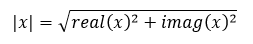
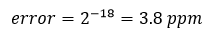
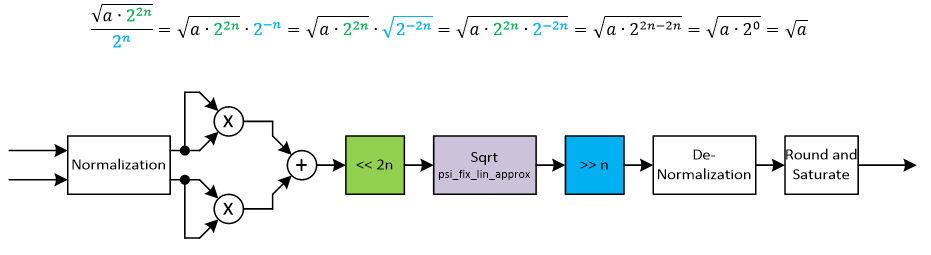

***

[**component list**](../README.md)

# psi_fix_complex_abs
 - VHDL source: [psi_fix_complex_abs](../../hdl/psi_fix_complex_abs.vhd)
 - Testbench source: [psi_fix_complex_abs_tb.vhd](../../testbench/psi_fix_complex_abs_tb/psi_fix_complex_abs_tb.vhd)

### Description

This entity implements the absolute value calculation for a complex number based on the formula below:

The square root function is approximated using [psi_fix_lin_approx_sqrt](../../hdl/psi_fix_lin_approx_sqrt.vhd) function. The resulting implementation uses way less LUT than a CORDIC but multipliers and a bit or BRAM. Since the linear approximation of the square root function is limited to 18 bits, the result can have a relative error (relative to the absolute value of the output):

Note that the solution uses multipliers for the squaring operation, so for number formats that are wider than the multipliers available, this entity may not achieve optimal timing.

### Generics
| Name           | type          | Description                                      |
|:---------------|:--------------|:-------------------------------------------------|
| in_fmt_g       | psi_fix_fmt_t | fp format in                                     |
| out_fmt_g      | psi_fix_fmt_t | fp format out                                    |
| round_g        | psi_fix_rnd_t | trunc or round (use truncation for high clock speeds)                                  |
| sat_g          | psi_fix_sat_t | wrap or sat  (use wrapping for high clock speeds)                                  |
| rst_pol_g      | std_logic     | reset polarity active high                       |
| ram_behavior_g | string        | rbw = read before write, wbr = write before read |

### Interfaces
| Name      | In/Out   | Length    | Description                  |
|:----------|:---------|:----------|:-----------------------------|
| clk_i     | i        | 1         | $$ type=clk; freq=127e6 $$   |
| rst_i     | i        | 1         | $$ type=rst; clk=clk_i $$    |
| dat_inp_i | i        | in_fmt_g) | data inphase i               |
| dat_qua_i | i        | in_fmt_g) | data quadrature q            |
| vld_i     | i        | 1         | valid signal in              |
| dat_o     | o        | i^2+q^2)  | results output dqrt(i^2+q^2) |
| vld_o     | o        | 1         | valid signal out             |

### Architecture

The figure below shows the architecture of the absolute value calculation.
For simple implementation, all formats are normalized to the range +/-1.0 and the normalized numbers are used for internal calculations. At the output, the normalization is reverted, so the normalization is completely invisible from outside.

Since the square root approximation is only valid in the range between 0.25 and 1.0, all numbers are first shifted into this range and the shift is compensated at the output of the calculation. This setup also allows for relatively precise results, even though the square root approximation is limited to 18 bits.
This concept works because:

---
[**component list**](../README.md)
