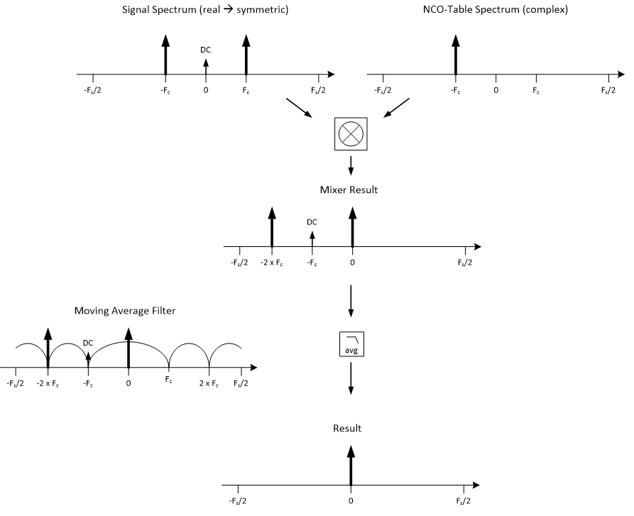
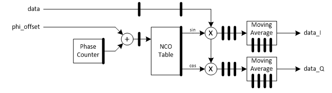

***

[**component list**](../README.md)

# psi_fix_demod_real2cplx
 - VHDL source: [psi_fix_demod_real2cplx](../../hdl/psi_fix_demod_real2cplx.vhd)
 - Testbench source: [psi_fix_demod_real2cplx_tb.vhd](../../testbench/psi_fix_demod_real2cplx_tb/psi_fix_demod_real2cplx_tb.vhd)

### Description

This entity implements a demodulator that takes a real input and produces a complex result (or IF frequency signal and bring to Baseband IQ). The demodulator first mixes the signal with a local oscillator (generated internally in the demodulator using a table) and then filters the output with a moving-average filter (comb-filter) with F_sample/F_carrier  taps. This algorithm is illustrated in the figures at the end of this section. The non-iq demodulation shall be used with coherent characteristics.
Example: Frequency IF 50MHz -> Frequency oscillator 250MHz then a ratio for demodulation of 5 should be inserted. Using numerator and denominator non integer ratio can be inserted.

The demodulator does only produce good quality results for very narrow-band signals with no significand out-of-band noise. If the signal has significant sidebands or noise, either additional filtering after the demodulator is required or a specialized demodulator must be written.
Another requirement of the demodulator is, that the carrier frequency is an integer fraction of the clock frequency.
The implementation supports multiple data channels with shared coefficients (i.e. the demodulation phase is the same for all channels). For multi-channel implementation, all channels must be synchronous (i.e. only one strobe/vld signal is provided that applies to all channels).

### Generics
| Name        | type           | Description                                          |
|:------------|:---------------|:-----------------------------------------------------|
| rst_pol_g   | std_logic      | reset polarity active high ='1'  										|
| in_fmt_g    | psi_fix_fmt_t; | input format fp           														|
| out_fmt_g   | psi_fix_fmt_t; | output format fp             												|
| coef_bits_g | positive       | internal coefficent number of bits  									|
| channels_g  | natural        | number of channels tdm             									|
| ratio_num_g | natural        | ratio numerator between clock and if/rf       				|
| ratio_den_g | natural        | ratio denominator between clock and if/rf        		|

### Interfaces
| Name         | In/Out   | Length                 | Description                           |
|:-------------|:---------|:-----------------------|:--------------------------------------|
| clk_i        | i        | 1                      | clk system $$ type=clk; freq=100e6 $$ |
| rst_i        | i        | 1                      | rst system $$ type=rst; clk=clk_i $$  |
| dat_i        | i        | in_fmt_g*channels_g    | data input if/rf                      |
| vld_i        | i        | 1                      | valid input freqeuncy sampling        |
| phi_offset_i | i        | ratio_num_g            | phase offset for demod lut            |
| dat_inp_o    | o        | out_fmt_g*channels_g   | inphase data output                   |
| dat_qua_o    | o        | out_fmt_g*channels_g   | quadrature data output                |
| vld_o        | o        | 1                      | valid output                          |

##### Notes
example: for 3 8-bit channels data is sorted as follows: ch0 -> bits 7..0, ch1 -> bits 15..8, ch2 -> bits 23..16

### Architecture
The figure below shows the implementation of the demodulator. For simplicity only one channel is shown.

The additional pipeline stage for the phase counter does not have to be compensated because the phase counter is incremented only after each sample and not before.

---
[**component list**](../README.md)
