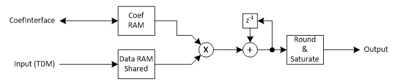
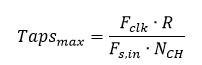

***

[**component list**](../README.md)

# psi_fix_fir_dec_ser_nch_chtdm_conf
 - VHDL source: [psi_fix_fir_dec_ser_nch_chtdm_conf](../../hdl/psi_fix_fir_dec_ser_nch_chtdm_conf.vhd)
 - Testbench source: [psi_fix_fir_dec_ser_nch_chtdm_conf_tb.vhd](../../testbench/psi_fix_fir_dec_ser_nch_chtdm_conf_tb/psi_fix_fir_dec_ser_nch_chtdm_conf_tb.vhd)

### Description

This entity was initially implemented as filter with configurable coefficients. However, it can also be used efficiently for filters with fixed coefficients.
This component implements a multi-channel decimating FIR filter. All channels are processed TDM (one after the other). The multiplications are all executed using the same multiplier, so the taps of a channel are calculated one after the other. The filter coefficients, the order and the decimation rate are runtime configurable.

### Generics
| Name            | type          | Description                                      |
|:----------------|:--------------|:-------------------------------------------------|
| in_fmt_g        | psi_fix_fmt_t | internal format                                  |
| out_fmt_g       | psi_fix_fmt_t | output format                                    |
| coef_fmt_g      | psi_fix_fmt_t | coefficient format                               |
| channels_g      | natural       | channels                                         |
| max_ratio_g     | natural       | max decimation ratio                             |
| max_taps_g      | natural       | max number of taps                               |
| rnd_g           | psi_fix_rnd_t | rounding truncation                              |
| sat_g           | psi_fix_sat_t | saturate or wrap                                 |
| use_fix_coefs_g | boolean       | use fix coefficients or update them              |
| coefs_g         | t_areal       | see doc                                          |
| ram_behavior_g  | string        | rbw = read before write, wbr = write before read |
| rst_pol_g       | std_logic     | reset polarity active high ='1'                  |

##### Notes

Decimation ratio -1
- 0 	-> no decimation
- 1 	-> decimation by 2)

This port is optional. If it is not connected, MaxRatio_g is used as fixed ratio.

Taps – 1
- 0 	-> 1 Tap (order 0 filter)
- 63 	-> 64 Taps (order 63 filter)

This port is optional. If it is not connected, MaxTaps_g is used as fixed tap count.

### Interfaces
| Name             | In/Out   | Length      | Description                         |
|:-----------------|:---------|:------------|:------------------------------------|
| clk_i            | i        | 1           | system clock                        |
| rst_i            | i        | 1           | system reset                        |
| dat_i            | i        | in_fmt_g)   | data input                          |
| vld_i            | i        | 1           | valid input frequency sampling      |
| dat_o            | o        | out_fmt_g)  | data output                         |
| vld_o            | o        | 1           | valid output new frequency sampling |
| coef_if_rd_dat_o | o        | coef_fmt_g) | coef read                           |
| busy_o           | o        | 1           | calculation on going active high    |

The coefficient interface has a separate clock since often the data processing clock is coupled to an ADC clock but the main bus system that configures the filter is running on a different clock.
The filter can continue taking new input data even if a calculation is ongoing. As a result, the handling of backpressure is not required as long as the processing power of the filter is sufficient to handle all input data. For the calculation, see below.
Note that the behavior of the filter is undefined if the maximum input rate that can be handled is exceeded.

### Architecture

The figure below roughly shows the architecture of the FIR filter. Since the channels arrive one after the other, the one dual-port RAM is sufficient to store all data. The RAM is split into different regions (i.e. the higher address bits select the region reserved for a given channel).

A state machine (not shown in the figure for simplicity) starts a new calculation whenever all required input samples for the next calculation arrived.
The accumulation is executed at the full output precision of the multiplication. This matches the implementation of the DSP slices in Xilinx devices, so they can be fully utilized.
The accumulator contains one guard bit compared to the output format to detect overflows. However, the user (designer who integrates the filter) is responsible to choose coefficients in a way that the output format is never exceeded by more than a factor of two. This this is not possible the filter output format must be chosen large enough ( Range_Output≥0.5∙MaximumOutput) and saturated externally.
Obviously the architecture requires one clock cycle per tap calculation of one channel. As a result the maximum number of filter taps depends on the number of channels N_CH clock frequency F_clk, the input sample rate F_(s,in) and the decimation ratio R.

In case of fixed coefficient implementation, the coefficient RAM is replaced by a ROM automatically.

**Important note**: Changing the decimation rate and/or the filter order at runtime can temporarily lead to inconsistent settings because usually they are changed by register accesses that are executed one after the other. To avoid this problem, it is suggested to keep the filter in reset whenever the parameters are changed.

---
[**component list**](../README.md)
