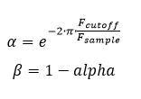

***

[**component list**](../README.md)

# psi_fix_lowpass_iir_order1_conf
 - VHDL source: [psi_fix_lowpass_iir_order1_conf](../../hdl/psi_fix_lowpass_iir_order1_conf.vhd)
 - Testbench source: [psi_fix_lowpass_iir_order1_conf_tb.vhd](../../testbench/psi_fix_lowpass_iir_order1_conf_tb/psi_fix_lowpass_iir_order1_conf_tb.vhd)

### Description

This entity implements a first order IIR low-pass filter with the same structure as **psi_fix_lowpass_iir_order1**, but with the alpha coefficient provided as a runtime input (`cfg_alpha_i`) instead of being calculated from `f_sample_hz_g` / `f_cutoff_hz_g` generics.

The coefficient must be calculated externally (e.g. in software):
```
tau   = 1 / (2 * pi * f_cutoff)
alpha = exp(-(1 / f_sample) / tau) = exp(-2 * pi * f_cutoff / f_sample)
```
`beta = 1 - alpha` is derived internally using saturated arithmetic, so `alpha = 0` results in `beta = 1 - 2^-F` instead of exactly 1.0.

`cfg_alpha_i` is given in `coef_fmt_g` format with valid range **[0, 1)**.

**Important:** Only change `cfg_alpha_i` quasi-statically (e.g. while in reset or between acquisitions) to avoid inconsistent alpha/beta pairs within the pipeline.

Note that the filter is targeted mainly to applications where the cutoff frequency is only one or two orders of magnitude lower than the sampling frequency.
For cases where the cutoff frequency is close to DC, the requirements for coefficient precision grow with this straight-forward filter structure. In this case a completely different structure especially targeted to low cutoff frequencies should be used instead of this standard component.

### Generics
| Name             | type          | Description                                                                     |
|:-----------------|:--------------|:--------------------------------------------------------------------------------|
| in_fmt_g         | psi_fix_fmt_t | $$constant='(1, 0, 15)'$$                                                       |
| out_fmt_g        | psi_fix_fmt_t | $$constant='(1, 0, 15)'$$                                                       |
| int_fmt_g        | psi_fix_fmt_t | number format for calculations, for details see documentation                   |
| coef_fmt_g       | psi_fix_fmt_t | coef format, alpha valid range [0, 1)                                           |
| round_g          | psi_fix_rnd_t | round or trunc                                                                  |
| sat_g            | psi_fix_sat_t | sat or wrap                                                                     |
| pipeline_g       | boolean       | true = optimize for clock speed, false = optimize for latency $$ export=true $$ |
| reset_polarity_g | std_logic     | reset polarity active high = '1'                                                |

### Interfaces
| Name        | In/Out | Length    | Description                                            |
|:------------|:-------|:----------|:-------------------------------------------------------|
| clk_i       | i      | 1         | clock input                                            |
| rst_i       | i      | 1         | sync. reset                                            |
| cfg_alpha_i | i      | coef_fmt_g | alpha coefficient (online configurable)                |
| dat_i       | i      | in_fmt_g  | data in                                                |
| vld_i       | i      | 1         | input valid signal                                     |
| dat_o       | o      | out_fmt_g | data out                                               |
| vld_o       | o      | 1         | output valid signal                                    |

### Architecture

The filter implements the same first-order IIR low-pass structure as **psi_fix_lowpass_iir_order1**. The coefficient registers (`cfg_alpha_i`) are captured and `beta = 1 - alpha` is derived internally via saturated subtraction.

When `pipeline_g = True`, the filter has 5 pipeline stages (higher clock speed, 5 cycles latency). When `pipeline_g = False`, the filter has 3 pipeline stages (lower clock speed, 3 cycles latency).



---
[**component list**](../README.md)
