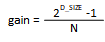
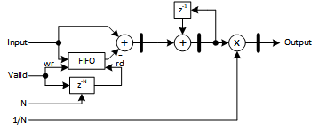

---

[**component list**](../README.md)

# psi_fix_mov_avg

- VHDL source: [psi_fix_mov_avg_var](../../hdl/psi_fix_mov_avg_var.vhd)
- Testbench source: [psi_fix_mov_avg_tb.vhd](../../testbench/psi_fix_mov_avg_var_tb/psi_fix_mov_avg_var_tb.vhd)

### Description

This entity implements a moving average with variable number of taps changed in run-time. The number of taps and gain correction has to be provided by the user.

The delay line is implemented using FIFO.

The gain of the filter including the compensation can be calculated by the formulas below:

where:

- D_SIZE - is number of bits of input data
- N - number of taps

The gain factor has always fixed point format of (0,0,D_SIZE)

### Generics

| Name       | type          | Description                     |
| :--------- | :------------ | :------------------------------ |
| in_fmt_g   | psi_fix_fmt_t | format of input and output data |
| max_taps_g | positive      | maximal number of taps          |

### Interfaces

| Name   | In/Out | Length               | Description                     |
| :----- | :----- | :------------------- | :------------------------------ |
| clk_i  | i      | 1                    | system clock                    |
| rst_i  | i      | 1                    | system reset                    |
| taps_i | i      | log2ceil(max_taps_g) | number of taps                  |
| gain_i | i      | (0,0, size(dat_i))   | gain correction                 |
| dat_i  | i      | in_fmt_g             | data input                      |
| vld_i  | i      | 1                    | valid input sampling frequency  |
| dat_o  | o      | out_fmt_g            | data output                     |
| vld_o  | o      | 1                    | valid output sampling frequency |

### Architecture

The figure below shows the implementation of the moving average filter. The data delay is achieved using FIFO. After setting new number of taps, the FIFO read signal is delayed by number of taps.

---

[**component list**](../README.md)
