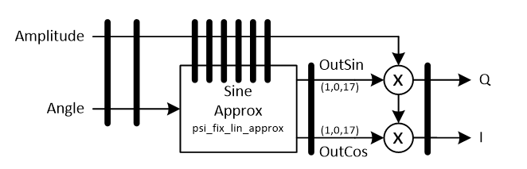

***

[**component list**](../README.md)

# psi_fix_pol2cart_approx
 - VHDL source: [psi_fix_pol2cart_approx](../../hdl/psi_fix_pol2cart_approx.vhd)
 - Testbench source: [psi_fix_pol2cart_approx_tb.vhd](../../testbench/psi_fix_pol2cart_approx_tb/psi_fix_pol2cart_approx_tb.vhd)

### Description

This entity implements a polar to cartesian conversion based on a linear approximation of the sine/cosine function. In most cases (especially for signals with less than 18 bits) this approach offers a better tradeoff between resource usage and performance.

Compared to the CORDIC implementation, 4 instead of 2 or 0 28x18 multipliers (depending on gain correction) are used and additional 72kBit of BRAM are used (= 4 RAMB18). On the other hand the LUT usage is lower than for the serial CORDIC implementation and the throughput is the same as for the pipelined CORDIC implementation.

### Generics
| Name           | type          | Description                              |
|:---------------|:--------------|:-----------------------------------------|
| in_abs_fmt_g   | psi_fix_fmt_t | must be unsigned  |
| in_angle_fmt_g | psi_fix_fmt_t | must be unsigned, watch out usually (1,0,x)|
| out_fmt_g      | psi_fix_fmt_t | usually signed    |
| round_g        | psi_fix_rnd_t | round or trunc   (use truncation for high clock speeds)                        |
| sat_g          | psi_fix_sat_t | sat or wrap  (use wrapping for high clock speeds)                              |
| rst_pol_g      | std_logic     | reset polarity                           |

### Interfaces
| Name      | In/Out   | Length          | Description                           |
|:----------|:---------|:----------------|:--------------------------------------|
| clk_i     | i        | 1               | clk system $$ type=clk; freq=100e6 $$ |
| rst_i     | i        | 1               | rst system $$ type=rst; clk=clk_i $$  |
| dat_abs_i | i        | in_abs_fmt_g)   | data amplitude                        |
| dat_ang_i | i        | in_angle_fmt_g) | data phase                            |
| vld_i     | i        | 1               | valid input signal freqeucy sampling  |
| dat_inp_o | o        | out_fmt_g)      | data inphase                          |
| dat_qua_o | o        | out_fmt_g)      | data quadrature                       |
| vld_o     | o        | 1               | valid output                          |

### Architecture

Note that some additional output registers outside the entity may be required if rounding and saturation are used.

---
[**component list**](../README.md)
