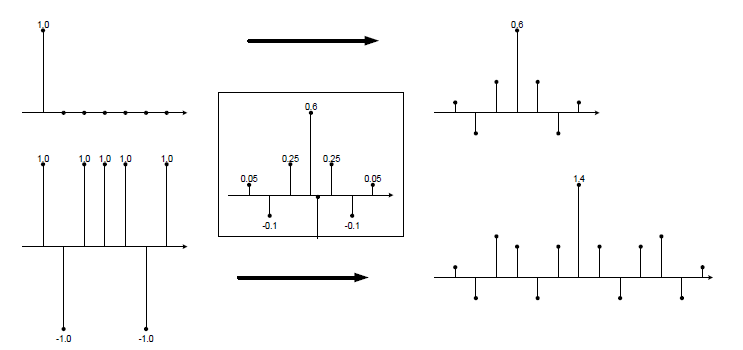

***

[**component list**](../README.md)

### Design flow

#### Phase 1: Algorithm Feasibility Check
In this phase, any open points regarding the algorithm are checked in Python. If the algorithm is not exactly specified by the customer, different approaches can be tried out. Main goal of this phase is to know what algorithm gets implemented and to get familiar with it.

#### Phase 2: Design & Documentation
This phase involves all the design work in terms of block-diagrams, RTL drawings and fixed-point number
formats. All the design work is written down in the living document.
For wide additions, multiplications and storage of significant amounts of data, the resources required (at least DSP slices and BRAMs) should be calculated in this stage. Especially if a design is highly optimized or contains wide data-paths that do not fit into a single DSP-slice, it makes sense to draw detailed RTL schematics that show all pipeline stages and operations.
Document all fixed-point formats, also internal ones. Thinking about each and every number format prevents you from missing important aspects such as the word width-growth in CIC or FIR filters.
**IMPROTANT**: This phase does not include any Python or VHDL coding. Try to avoid start coding before
everything is designed (if possible in terms of schedule). If roadblocks are found during design of one specific block, this can have a big impact to the architecture of the whole system and existing code may be rendered useless.

#### Phase 3: Implement and Test Python Models
In this phase bit-true Python models are implemented and tested. Especially the term “tested” is important. Bit-true Python models only make sense if the models are really evaluated for their correctness. This includes testing with worst-case stimuli. If only some “standard stimuli” are used, the whole idea of only going to VHDL after Python models were fully verified is broken.
Also think about stimuli than make debugging in VHDL easy. A simple example of choosing stimuli for a FIR filter is given below:

-	If an FIR filter is simulated, it should not only be stimulated with white noise. In terms of debugging, it is a good idea to stimulate the filter with a dirac impulse since it should output exactly its coefficients for this stimuli signal. This is quite easy to debug. One worst-case could be stimulating the filter with a signal consisting of only +1 and -1 that perfectly matches the signs of the coefficients (e.g. [+1 -1 +1 +1 +1 -1 +1] for coefficients [0.05 -0.1 0.25 0.6 0.25 -0.1 0.05]). This signal leads to the absolute maximum output and stimulates any output saturation (if present). White noise would most likely not include this worst-case within a reasonable amount of stimuli data.
This is shown in the figure below. The filter has a DC gain of exactly 1.0 but with worst case stimuli,
the output can reach 1.4.

**Stimuli example for FIR filter**

#### Phase 4: Python Co-Simulations

Python Co-Simulations are usually very close to the tests described above (or even in the same script). The only difference is that stimuli and response data are written to files.
For Co-Simulations it is a good idea to implement calls to the Python simulations directly in the Modelsim regression test script (with the PsiSim TCL framework this is easily possible using pre-scripts).

#### Phase 5: VHDL Implementation and Co-Simulation
In this phase the VHDL code is implemented and tested for it’s bit-trueness compared to the Python model.

#### Phase 6: Test on HW
This is quite self-explaining. If all the steps above are executed correctly, no issues occur here.
… Okay, to be honest: “No issues” was never observed in real life. But at least less issues occur here.

#### Phase 7: Maintenance
Do not try to deliver any dirty quick-fixes that are just implemented in VHDL and tested on HW without writing any testbenches for it or modifying existing ones.
… No, also not if you are in a hurry …
… NO!!! Don’t even think about it!!!
The reason for this strong emphasis is that if one testbench fails, the automated regression tests fail. As a result the regression test script is not ran or errors are tolerated and nobody notices other testbenches going out of date. Within a short time the whole investment into a working regression test suite can be lost this way.
