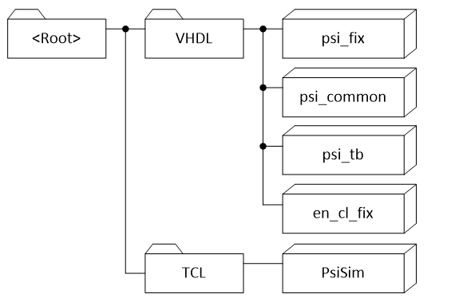
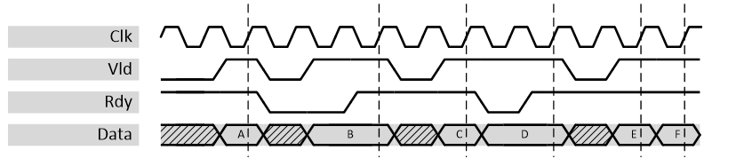

***

[**component list**](../README.md)

###	Introduction
The purpose of this library is to provide HDL implementations for common fixed-point signal processing components along with bittrue Python models. The Python models are also callable from MATLAB.

This document serves as description of the RTL implementation for all components.

####	Usage of en_cl_fix provided by Enclustra GmbH
For all fixed-point calculations, the package en_cl_fix provided by [Enclustra GmbH](www.enclustra.com) is used. The Enclustra packabe is wrapped by a package called psi_fix for historical reasons. In first versions, the implementations were independent but with version 2.0.0 the decision was taken to utilize the existing package from Enclustra instead of maintaining a separate one.

Note that conversion functions between the en_cl_fix and the psi_fix are provided in all languages, so library elements of both worlds can easily be mixed.
####	Working Copy Structure
If you just want to use some components out of the psi_fix library, the only requirement is to checkout psi_common into the same directory as psi_fix (side-by-side). The reason for this is that psi_fix uses some components from the library psi_common. The same applies to the fixed-point package en_cl_fix provided by Enclustra GmbH (but forked to the PSI GitHub account).

If you want to also run simulations and/or modify the library, additional repositories are required (available from the same source as psi_fix) and they must be checked out into the folder structure shown in the figure below since the repositories reference each-other relatively.

**Working copy structure**

It is not necessary but recommended to use the name psi_lib as name for the <Root> folder.

####	External Dependencies
-	Python 3.5 or higher is required to run the bit-true models of the psi_fix library (which implicitly happens during regression tests)
-	Python 3 must be callable using “python3” from the command line on your system. For Linux this is the default, for windows it is recommended to create a copy of python.exe that is named python3.exe. Additionally the path to the python directory must be added to the PATH environment variable.
- The following packages from pip must be installed (“pip install <package>”)
	-	Scipy
	-	numpy

#### VHDL Libraries
The PSI VHDL libraries (including psi_fix) require all files to be compiled into the same VHDL library.
There are two common ways of using VHDL libraries when using PSI VHDL libraries:

a)	All files of the project (including project specific sources and PSI VHDL library sources) are compiled into the same library that may have any name.
In this case PSI library entities and packages are referenced by work.psi_<library>_<xxx> (e.g. work.psi_fix_bin_div or work.psi_common_array_pkg.all).

b)	All code from PSI VHDL libraries is compiled into a separate VHDL library. It is recommended to use the name psi_lib.
In this case PSI library entities and packages are referenced by psi_lib.psi_<lib>_<xxx> (e.g. psi_lib.psi_fix_bin_div or psi_lib.psi_common_array_pkg.all).

---
###	Running Simulations
####	Regression Test
##### Modelsim
To run the regression test, follow the steps below:
-	Open Modelsim
-	The TCL console, navigate to <Root>/VHDL/psi_common/sim
-	Execute the command “source ./run.tcl”
All test benches are executed automatically and at the end of the regression test, the result is reported.

##### GHDL
In order to run the regression tests using GHDL, GHDL must be installed and added to the path variable. Additionally a TCL interpreter must be installed.
To run the regression tests using GHDL, follow the steps below:
-	Open the TCL interpreter (usually by running tclsh)
-	The TCL console, navigate to <Root>/VHDL/psi_common/sim
-	Execute the command “source ./runGhdl.tcl”

All test benches are executed automatically and at the end of the regression test, the result is reported
####	Working Interactively
During work on library components, it is important to be able to control simulations interactively. To do so, it is suggested to follow the following flow:
- Open Modelsim
- The TCL console, navigate to <Root>/VHDL/psi_common/sim
- Execute the command “source ./interactive.tcl”
  - This will compile all files and initialize the PSI TCL framework
  -	From this point on, all the commands from the PSI TCL framework are available, see documentation of PsiSim
-	Most useful commands to recompile and simulate entities selectively are
  - compile_files –contains <string>
  - run_tb –contains <string>
The steps for GHDL are the same, just in the TCL interpreter shall instead of the Modelsim TCL console.

###	Contribute to PSI VHDL Libraries
To contribute to the PSI VHDL libraries, a few rules must be followed:
-	Good Code Quality
		- There are not hard guidelines. However, your code shall be readable, understandable, correct and save.
		- No camelCase snake_case and ports must follow suffixes as such:
			- input:  -_i
			- output: -_o
			- generic: -_g	   	
- Configurability
	- If there are parameters that other users may have to modify at compile-time, provide generics. Only code that is written in a generic way and can easily be reused will be accepted.
- **Bit-true model**
	- A bit-true python model must be provided for psi_fix components. Otherwise they will not be accepted.
-	**Self checking Test-benches**
  	- It is mandatory to provide a self-checking test-bench with your code.
		- The test-bench shall cover all features of your code
  	- The test-bench shall automatically stop after it is completed (all processes halted, clock-generation stopped). See existing test-benches provided with the library for examples.
  	- The test-bench shall only do reports of severity error, failure or even fatal if there is a real problem.
  - If an error occurs, the message reported shall start with “###ERROR###:”. This is required since the regression test script searches for this string in reports.
  - For psi_fix, the test bench must call the python model and check if VHDL and python are bit-true
- **Documentation**
 - Extend documentation through md file and copy the link in [../README.md](../README.md)

- **New test-benches must be added to the regression test-script**
  - Change /sim/config.tcl accordingly
  - Test if the regression test really runs the new test-bench and exits without errors before doing any merge requests.

---

###	Handshaking Signals

####	General Information
The PSI library uses the AXI4-Stream handshaking protocol (herein after called AXI-S). Not all entities may implement all optional features of the AXI-S standard (e.g. backpressure may be omitted) but the features available are implemented according to AXI-S standard and follow these rules.
The full AXI-S specification can be downloaded from the ARM homepage:
https://developer.arm.com/docs/ihi0051/a
The most important points of the specification are outlined below.

####	Excerpt of the AXI-S Standard
A data transfer takes place during a clock cycle where TVALID and TREADY (if available) are high. The order in which they are asserted does not play any role.
-	A master is not permitted to wait until TREADY is asserted before asserting TVALID.
-	Once TVALID is asserted it must remain asserted until the handshake occurs.
-	A slave is permitted to wait for TVALID to be asserted before asserting the corresponding TREADY.
-	If a slave asserts TREADY, it is permitted to de-assert TREADY before TVALID is asserted.
An example an AXI handshaking waveform is given below. All the points where data is actually transferred are marked with dashed lines.

**Handshaking signals**

####	Naming
The naming conventions of the AXI-S standard are not followed strictly. The most common synonyms that can be found within the PSI VHDL libraries are described below:
- TDATA	dat_i, data_i, dat_o, dat_o <application specific names>
- TVALID	vld_i, str_i
- TREADY	rdy_i, rdy_o
Note that instead of one TDATA signal (as specified by AXI-S) the PSI VHDL Library sometimes has multiple data signals that are all related to the same set of handshaking signals. This helps with readability since different data is represented by different signals instead of just one large vector.

---
[**component list**](../README.md)
