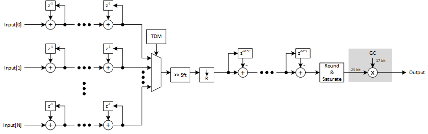

***

[**component list**](../README.md)

# psi_fix_cic_dec_fix_nch_par_tdm
 - VHDL source: [psi_fix_cic_dec_fix_nch_par_tdm](../../hdl/psi_fix_cic_dec_fix_nch_par_tdm.vhd)
 - Testbench source: [psi_fix_cic_dec_fix_nch_par_tdm_tb.vhd](../../testbench/psi_fix_cic_dec_fix_nch_par_tdm_tb/psi_fix_cic_dec_fix_nch_par_tdm_tb.vhd)

### Description

This component implements a decimating multi-channel CIC filter that takes all channels in parallel on the input side but delivers output in TDM fashion.
This filter is equal to the one described in 3.2, the only difference is that it supports multiple channels. see [link](psi_fix_cic_dec_fix_1ch.md)

The CIC is able to process one input sample per clock cycle. Therefore no backpressure handling is implemented on the input.
CIC are most commonly used in streaming signal processing systems that require processing or storing the data at the full speed anyway. So no backpressure handling is implemented on the output side for simplicity

### Generics
| Name             | type          | Description                                                        |
|:-----------------|:--------------|:-------------------------------------------------------------------|
| channels_g       | integer       | min. 2                                                             |
| order_g          | integer       | cic filter order                                                   |
| ratio_g          | integer       | decimation ratio watch out the number of channels                  |
| diff_delay_g     | natural       | diffrential delay                                                  |
| in_fmt_g         | psi_fix_fmt_t | input format fp                                                    |
| out_fmt_g        | psi_fix_fmt_t | output fromat fp                                                   |
| rst_pol_g        | std_logic;    | reset polarity active high = '1'                                   |
| auto_gain_corr_g | boolean       | uses up to 25 bits of the datapath and 17 bit correction parameter |

### Interfaces
| Name   | In/Out   | Length     | Description                                  |
|:-------|:---------|:-----------|:---------------------------------------------|
| clk_i  | i        | 1          | clk system                                   |
| rst_i  | i        | 1          | rst system                                   |
| dat_i  | i        | in_fmt_g*channels_g   | Input data in parallel Channel 0 [N-1:0] - Channel 1 [2*N-1:0]                                  |
| vld_i  | i        | 1          | valid input frequency sampling               |
| dat_o  | o        | out_fmt_g*channels_g  | Output data in TDM fashion. The first output sample is Channel 0, then Channel 1     |
| vld_o  | o        | 1          | valid output new frequency sampling fs/ratio |
| busy_o | o        | 1          | Asserted one clock cycle after (InVld=1); deasserted one clock cycle after (OutVld=1) only when no further data is processed     |

---
[**component list**](../README.md)
