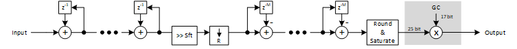

***

[**component list**](../README.md)

# psi_fix_cic_dec_fix_nch_tdm_tdm
 - VHDL source: [psi_fix_cic_dec_fix_nch_tdm_tdm](../../hdl/psi_fix_cic_dec_fix_nch_tdm_tdm.vhd)
 - Testbench source: [psi_fix_cic_dec_fix_nch_tdm_tdm_tb.vhd](../../testbench/psi_fix_cic_dec_fix_nch_tdm_tdm_tb/psi_fix_cic_dec_fix_nch_tdm_tdm_tb.vhd)

### Description

This component implements a decimating multi-channel CIC filter that works in TDM fashion.
This filter is equal to the one described in psi_fix_cic_dec_fix_1ch , the only difference is that it supports multiple channels. So for details refer to [psi_fix_cic_dec_fix_1ch](psi_fix_cic_dec_fix_1ch.md).

The CIC is able to process one input sample per clock cycle. Therefore no backpressure handling is implemented on the input.
CIC are most commonly used in streaming signal processing systems that require processing or storing the data at the full speed anyway. So no backpressure handling is implemented on the output side for simplicity

### Architecture

### Generics
| Name             | type          | Description                                                        |
|:-----------------|:--------------|:-------------------------------------------------------------------|
| channels_g       | integer       | min. 2                                                             |
| order_g          | integer       | cic filter order                                                   |
| ratio_g          | integer       | decimation ratio watch out the number of channels                  |
| diff_delay_g     | natural       | differential delay                                                 |
| in_fmt_g         | psi_fix_fmt_t | input format fp                                                    |
| out_fmt_g        | psi_fix_fmt_t | output format fp                                                   |
| rst_pol_g        | std_logic     | reset polarity active high = '1'                                   |
| auto_gain_corr_g | boolean       | uses up to 25 bits of the datapath and 17 bit correction parameter |

### Interfaces
| Name   | In/Out   | Length     | Description                              |
|:-------|:---------|:-----------|:-----------------------------------------|
| clk_i  | i        | 1          | clk system                               |
| rst_i  | i        | 1          | rst system                               |
| dat_i  | i        | in_fmt_g)  | data input fp                            |
| vld_i  | i        | 1          | valid input frequency sampling           |
| dat_o  | o        | out_fmt_g) | data output fp                           |
| vld_o  | o        | 1          | valid output frequency sampling fs/ratio |
| busy_o | o        | 1          | busy/ready signal active high            |

---
[**component list**](../README.md)
