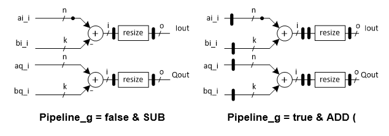

***

[**component list**](../README.md)

# psi_fix_complex_addsub
 - VHDL source: [psi_fix_complex_addsub](../../hdl/psi_fix_complex_addsub.vhd)
 - Testbench source: [psi_fix_complex_addsub_tb.vhd](../../testbench/psi_fix_complex_addsub_tb/psi_fix_complex_addsub_tb.vhd)

### Description
The block performs addition/subtraction on a complex number pair (Inphase & Quadrature, inputs of the block), let two complex numbers be:

x=(a+ib);y=(c+id)

The Addition result comes:

x+y=(a+c)+i(b+d)

The Addition result comes:

x-y=(a-c)+i(b-d)

The total pipeline delay of the block is 2 clock cycles if no pipeline activation is set through generics, otherwise the pipeline is doubled.

### Generics
| Name              | type          | Description                                                                     |
|:------------------|:--------------|:--------------------------------------------------------------------------------|
| generic(rst_pol_g | std_logic     | set reset polarity   |
| pipeline_g        | boolean       | when false 3 pipes stages, when false 6 pipes (increase fmax) $$ export=true $$ |
| in_a_fmt_g        | psi_fix_fmt_t | input a fixed point format          |
| in_b_fmt_g        | psi_fix_fmt_t | input b fixed point format  |
| out_fmt_g         | psi_fix_fmt_t | output fixed point format    |
| round_g           | psi_fix_rnd_t | round or trunc  |
| sat_g             | psi_fix_sat_t | adder or subtracter  |
| add_sub_g         | string        | **True** Add; **False** Sub; Select to use the block in adder or subtraction mode                                |

### Interfaces
| Name          | In/Out   | Length      | Description                         |
|:--------------|:---------|:------------|:------------------------------------|
| clk_i         | i        | 1           | clk      |
| rst_i         | i        | 1           | sync. rst  |
| dat_ina_inp_i | i        | in_a_fmt_g) | inphase input of signal a           |
| dat_ina_qua_i | i        | in_a_fmt_g) | quadrature input of signal a        |
| dat_inb_inp_i | i        | in_b_fmt_g) | inphase input of signal b           |
| dat_inb_qua_i | i        | in_b_fmt_g) | quadrature input of signal b        |
| vld_i         | i        | 1           | strobe input                        |
| dat_out_inp_o | o        | out_fmt_g)  | data output i                       |
| dat_out_qua_o | o        | out_fmt_g)  | data output q                       |
| vld_o         | o        | 1           | strobe output                       |

### Architecture

---
[**component list**](../README.md)
