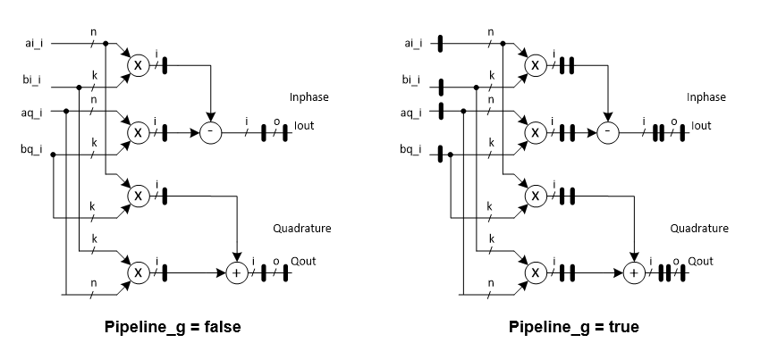

***

[**component list**](../README.md)

# psi_fix_complex_mult
 - VHDL source: [psi_fix_complex_mult](../../hdl/psi_fix_complex_mult.vhd)
 - Testbench source: [psi_fix_complex_mult_tb.vhd](../../testbench/psi_fix_complex_mult_tb/psi_fix_complex_mult_tb.vhd)

### Description

The block performs multiplication on a complex number pair (Inphase & Quadrature, inputs of the block) or 2D matrix computation, let two complex numbers be:

x=(a+ib);y=(c+id)

The multiplication result comes:

x.y=(a+ib)(c+id)=(ac-bd)+i(ad+bc)

The total pipeline delay of the block is 3 clock cycles if no pipeline activation is set through generics, otherwise the pipeline is doubled (i.e. 6 stages)

### Generics
| Name           | type          | Description                                                                     |
|:---------------|:--------------|:--------------------------------------------------------------------------------|
| rst_pol_g      | std_logic     | set reset polarity                                          |
| pipeline_g     | boolean       | when false 3 pipes stages, when false 6 pipes (increase fmax)  |
| in_a_fmt_g     | psi_fix_fmt_t | input a fixed point format $$                              |
| in_b_fmt_g     | psi_fix_fmt_t | input b fixed point format     |
| internal_fmt_g | psi_fix_fmt_t | internal calc. fixed point format  |
| out_fmt_g      | psi_fix_fmt_t | output fixed point format  |
| round_g        | psi_fix_rnd_t | trunc or round  |
| sat_g          | psi_fix_sat_t | sat or wrap |
| in_a_is_cplx_g | boolean       | complex number?  Set to false if input A is real (not complex, aq_i = 0) to save multipliers                                               |
| in_b_is_cplx_g | boolean       | Set to false if input B is real (not complex, bq_i = 0) to save multipliers                     |

### Interfaces
| Name          | In/Out   | Length      | Description                         |
|:--------------|:---------|:------------|:------------------------------------|
| clk_i         | i        | 1           | clk $$ type=clk; freq=100e6 $$      |
| rst_i         | i        | 1           | sync. rst $$ type=rst; clk=clk_i $$ |
| dat_ina_inp_i | i        | in_a_fmt_g) | inphase input of signal a           |
| dat_ina_qua_i | i        | in_a_fmt_g) | quadrature input of signal a        |
| dat_inb_inp_i | i        | in_b_fmt_g) | inphase input of signal b           |
| dat_inb_qua_i | i        | in_b_fmt_g) | quadrature input of signal b        |
| vld_i         | i        | 1           | strobe input                        |
| dat_inp_o     | o        | out_fmt_g)  | data output i                       |
| dat_qua_o     | o        | out_fmt_g)  | data output q                       |
| vld_o         | o        | 1           | strobe output                       |

### Architecture

---
[**component list**](../README.md)
