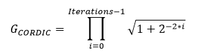
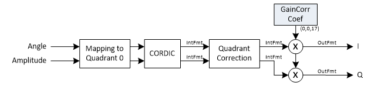

***

[**component list**](../README.md)

# psi_fix_cordic_rot
 - VHDL source: [psi_fix_cordic_rot](../hdl/psi_fix_cordic_rot.vhd)
 - Testbench source: [psi_fix_cordic_rot_tb.vhd](../testbench/psi_fix_cordic_rot_tb/psi_fix_cordic_rot_tb.vhd)

### Description

This entity implements the CORDIC algorithm for Polar to Cartesian conversion.
The CORDIC gain can optionally be compensated. If the gain is compensated externally, it is important to know the exact gain. Therefore the formula for calculating the CORDIC gain is given:

For the internal gain compensation it is recommended to choose an internal_fmt_g in a way that it can be processed with one multiplier (e.g. for 7-series max. 25 bits).

**Important Note:**
In most cases (especially for Signals < 18 bits), the entity [psi_fix_pol2cart_approx](psi_fix_pol2cart_approx.md)  offers a better trade-off between resource usage and performance than the psi_fix_cordic_rot. So it may be worth considering switching to that component.

### Generics
| Name            | type          | Description                                 |
|:----------------|:--------------|:--------------------------------------------|
| in_abs_fmt_g    | psi_fix_fmt_t | Format of the absolute (=amplitude) input (must be unsigned)    |
| in_angle_fmt_g  | psi_fix_fmt_t | Format of the angle input (must be unsigned), usually (1,0,x)    |
| out_fmt_g       | psi_fix_fmt_t | Output format for I/Q outputs, usually signed    |
| internal_fmt_g  | psi_fix_fmt_t | Internal calculation format for the X/Y components. (must be signed) The more fractional bits, the more precise the calculation gets.Choose enough integer bits to ensure that no overflows happen. 	For inputs with an amplitude <= 1.0, (1,1,y) can be used..     |
| angle_int_fmt_g | psi_fix_fmt_t | must be (1, -2, x). Internal calculation format for angles (must be signed).	The more fractional bits, the more precise the calculation gets. The value is always < 0.25 		(corresponds to 0.5 * π) since the calculation is always mapped into the same quadrant.  |
| iterations_g    | natural       | Number of CORDIC iterations        |
| gain_comp_g     | boolean       | **True**		The CORDIC gain (~1.62) is compensated internally with a multiplier. **False**		The CORDIC gain is not compensated.        |
| round_g         | psi_fix_rnd_t | round or trunc  (use truncation for high clock speeds)        |
| sat_g           | psi_fix_sat_t | sat or wrap  (use wrapping for high clock speeds)            |
| mode_g          | string        | **“PIPELINED”**	One pipeline stage per CORDIC iteration, can take one sample every clock cycle.	**“SERIAL”**		One clock cycle per iteration, less logic utilization      |

### Interfaces
| Name      | In/Out   | Length          | Description                              |
|:----------|:---------|:----------------|:-----------------------------------------|
| clk_i     | i        | 1               | clk system $$ type=clk; freq=100e6 $$    |
| rst_i     | i        | 1               | rst system $$ type=rst; clk=clk $$       |
| dat_abs_i | i        | in_abs_fmt_g)   | amplitude signal input                   |
| dat_ang_i | i        | in_angle_fmt_g) | phase signal input                       |
| vld_i     | i        | 1               | valid input                              |
| rdy_i     | o        | 1               | ready output signal $$ lowactive=true $$ |
| dat_inp_o | o        | out_fmt_g)      | dat inphase out                          |
| dat_qua_o | o        | out_fmt_g)      | dat quadrature out                       |
| vld_o     | o        | 1               | valid output                             |

The figure below shows the implementation of the vectoring CORDIC. The algorithm only works correctly in quadrant zero (where I and Q are positive). Therefore the input is mapped into this quadrant by sign swapping and the effect of this mapping is compensated at the output.

---
[**component list**](../README.md)
