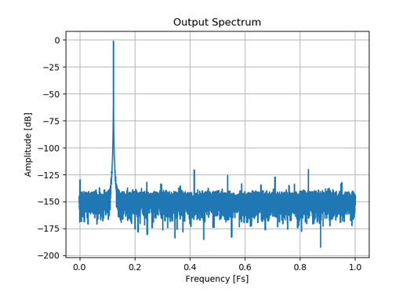
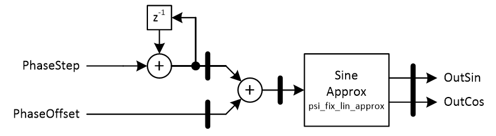

***

[**component list**](../README.md)

# psi_fix_dds_18b
 - VHDL source: [psi_fix_dds_18b](../../hdl/psi_fix_dds_18b.vhd)
 - Testbench source: [psi_fix_dds_18b_tb.vhd](../../testbench/psi_fix_dds_18b_tb/psi_fix_dds_18b_tb.vhd)

### Description

This entity implements an 18-bit direct digital synthesizer (DDS). The sine-wave is generated using the entity psi_fix_lin_approx_sin_18b and it has an error of less than one LSB for all values. As a result, there are no significant spurs in the generated spectrum (significant in terms of above the quantization noise floor) as shown in the figure below.

 The DDS supports single-channel or multi-channel TDM implementation.

### Generics
| Name           | type          | Description                                    |
|:---------------|:--------------|:-----------------------------------------------|
| phase_fmt_g    | psi_fix_fmt_t | phase format width => generally counter length |
| tdm_channels_g | positive      | time division multiplexed number of channels   |
| ram_behavior_g | string        | ram behavior read before write                 |
| rst_pol_g      | std_logic     | reset polarity active high = '1'               |
| rst_sync_g     | boolean       | reset sync or async                            |

### Interfaces
| Name         | In/Out   | Length       | Description                                       |
|:-------------|:---------|:-------------|:--------------------------------------------------|
| clk_i        | i        | 1            | clk system                                        |
| rst_i        | i        | 1            | rst system                                        |
|restart_i   | i  | 1  | This signal can be used to start the DDS again at the phase offset. This is useful if 100% reproducible outputs must be generated several times.  |
| phi_step_i   | i        | rasterized   | Phase step between two consecutive output samples. The phase step is given in 2π (0.5 corresponds to π). The phase step can be changed at runtime safely. |
| phi_offset_i | i        | phase_fmt_g  | Phase offset of the generated signal. The phase offset is given in 2π (0.5 corresponds to π). The phase offset can be changed at runtime safely.                                      |
|vld_i   | i  | 1  | AXI-S handshaking signal that can be used to generate samples at any rate. For continuous operation (one sample per clock cycle) , the signal can be left unconnected. The inputs restart_i, phi_step_i and phi_offset_i are latched on vld_i=1.
| dat_sin_o    | o        | 17           | sinus output                                      |
| dat_cos_o    | o        | 17           | cosine output 90 degree phase shifted             |
| vld_o        | o        | 1            | frequency sampling output valid                   |

The total pipeline delay of the DDS is **10 clock cycles**.

### Architecture

##### Notes

When using the DDS in multi-channel TDM configuration, the inputs (phi_step_i, phi_offset_i, restart_i) of all channels must be applied in turns

---
[**component list**](../README.md)
