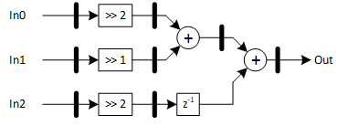
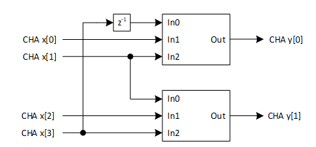

***

[**component list**](../README.md)

# psi_fix_fir_3tap_hbw_dec2
 - VHDL source: [psi_fix_fir_3tap_hbw_dec2](../hdl/psi_fix_fir_3tap_hbw_dec2.vhd)
 - Testbench source: [psi_fix_fir_3tap_hbw_dec2_tb.vhd](../testbench/psi_fix_fir_3tap_hbw_dec2_tb/psi_fix_fir_3tap_hbw_dec2_tb.vhd)

### Description
This component implements a decimating by 2 half-bandwidth filter. This particular implementation has 3 taps with fixed coefficients: 0.25, 0.5, 0.25. This enables efficient implementation based on bit shifting instead of multiplications. It can be used in a two modes of operation: Separate mode, in which all channels are independently processed (but still share AXI-S handshaking signals) and a second mode, in which input samples are processed as they come from one source. This enables decimate by N (where N is a power of two) by connecting more components of this type in a chained structure.

### Generics
| Name       | type          | Description                              |
|:-----------|:--------------|:-----------------------------------------|
| in_fmt_g   | psi_fix_fmt_t | input format fp                          |
| out_fmt_g  | psi_fix_fmt_t | output format fp                         |
| channels_g | natural       | number of channels tdm $$ export=true $$ |
| separate_g | boolean       | Separate mode (when true, each pair of inputs is treated as from separate source) |
| rnd_g      | psi_fix_rnd_t | round or trunc                           |
| sat_g      | psi_fix_sat_t | saturation or wrap                       |
| rst_pol_g  | std_logic     | reset polarity active high ='1'          |
| rst_sync_g | boolean       | async reset or sync architecture         |

##### Notes
Input data in parallel
Separete_g = true, two samples for each channel:
- Channel A Sample 0 [N-1:0]
- Channel A Sample 1 [2*N-1:0]
- Channel B Sample 0 [3*N-1:0]
- Channel B Sample 1 [4*N-1:0]
- etc

Separete_g = false, one channel
- Channel A Sample 0 [N-1:0]
- Channel A Sample 1 [2*N-1:0]
- Channel A Sample 2 [3*N-1:0]
- etc

Output data, one sample for each pair of inputs
Separete_g = true
- Channel A Sample 0 [N-1:0]
- Channel B Sample 0 [2*N-1:0]
- etc

Separete_g = false
- Channel A Sample 0 [N-1:0]
- Channel A Sample 1 [2*N-1:0]
- etc

### Interfaces
| Name   | In/Out   | Length     | Description                                       |
|:-------|:---------|:-----------|:--------------------------------------------------|
| clk_i  | i        | 1          | clk system $$ type=clk; freq=100e6; proc=input $$ |
| rst_i  | i        | 1          | rst system $$ type=rst; clk=clk $$                |
| dat_i  | i        | in_fmt_g)  | data input $$ proc=input $$                       |
| vld_i  | i        | 1          | valid input frequency sampling $$ proc=input $$   |
| dat_o  | o        | out_fmt_g) | data output $$ proc=output $$                     |
| vld_o  | o        | 1          | valid otuput $$ proc=output $$                    |

### architecture

The figure below shows a base structure that is used in all filter configurations. The structure consists of three binary shifts (acting as a multiplication by constant coefficient) followed by two adders.

Based on this structure, two different filter configurations can be build. When Separate_g = true, all channels run in parallel, although AXI-S handshaking signals are still shared. The figure below shows the example with Channels_g = 2. Here four samples for two channels A and B are processed in parallel that results in two decimated output samples, one for each channel.

When Separate_g = false the component processes samples from only one channel. The following figure displays example with Channels_g = 2. The filter takes 4 consecutive input samples from one source and decimates to two samples. It is now possible to use second filter that will further decimate from two to one sample.

---
[**component list**](../README.md)
