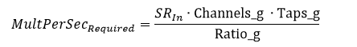
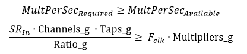
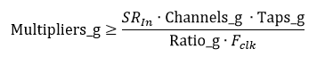
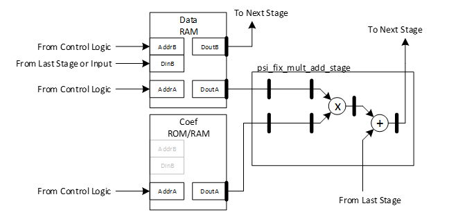
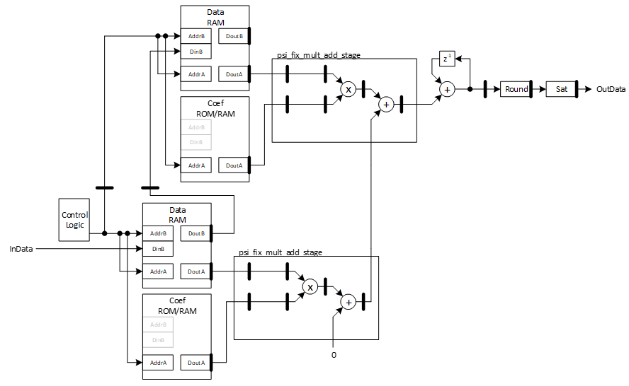
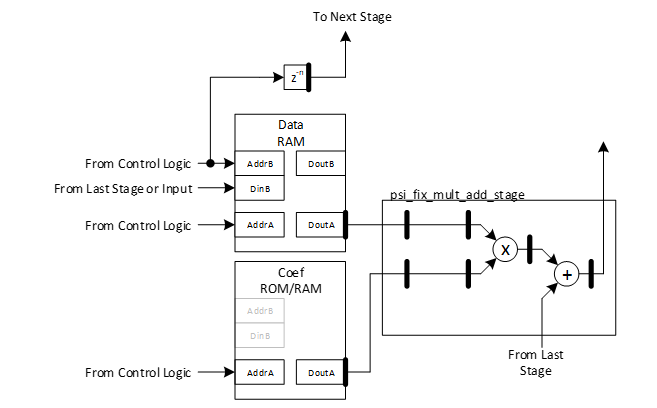

***

[**component list**](../README.md)

# psi_fix_fir_dec_semi_nch_chtdm_conf
 - VHDL source: [psi_fix_fir_dec_semi_nch_chtdm_conf](../hdl/psi_fix_fir_dec_semi_nch_chtdm_conf.vhd)
 - Testbench source: [psi_fix_fir_dec_semi_nch_chtdm_conf_tb.vhd](../testbench/psi_fix_fir_dec_semi_nch_chtdm_conf_tb/psi_fix_fir_dec_semi_nch_chtdm_conf_tb.vhd)

### Description

This entity implements a semi-parallel FIR filter for multiple channels (TDM). A configurable number of multiplier is working in parallel. The number of cycles to calculate one output sample depends on the filter order and the number of multipliers chosen. As a result, this filter architecture allows a wide range of trade-offs between resource consumption and processing power.
This filter does only implement the VLD signal of the AXI-S handshaking. Due to the absence of back-pressure handling using the RDY signal, the user is responsible for making sure that the processing power of the filter is sufficient to process all samples. Violation of this rule may lead to undefined behavior. However, in Simulations an error (VHDL-assertion) is thrown if this situation occurs.
The processing power (in multiplications) required can be calculated by the formula below:

Where:
SR_In:		Input sample rate in SPS
The processing power available can be calculated by the formula below:

To satisfy the rules, the following condition must be true:

From this, the required setting of Multipliers_g can be derived:

The filter can be implemented in two slightly different ways. One is more efficient in terms of memory required for the delay chain but it does not allow the vld_i to be asserted in two consecutive cycles. As a result, the input sample rate is only half of the theoretical limit. The other architecture consumes more memory but allows vld_i to be high all the time. The way the filter is implemented is controlled by the generic full_inp_rate_support_g.

Because the filter uses RAM blocks, old data may be left in the filter after a reset. Therefore, optionally a data flushing functionality can be implemented. This functionality allows overwriting all memories with zero after a reset.

### Generics
| Name                    | type          | Description                                          |
|:------------------------|:--------------|:-----------------------------------------------------|
| in_fmt_g                | psi_fix_fmt_t | input format fp $$ constant=(1,0,15) $$              |
| out_fmt_g               | psi_fix_fmt_t | output format fp $$ constant=(1,2,13) $$             |
| coef_fmt_g              | psi_fix_fmt_t | coef format fp $$ constant=(1,0,17) $$               |
| channels_g              | natural       | number of parallel channels $$ export=true $$        |
| multipliers_g           | natural       | number of multipliers to use in parallel             |
| ratio_g                 | natural       | decimation ratio                                     |
| taps_g                  | natural       | number of taps implemented                           |
| rnd_g                   | psi_fix_rnd_t | round or trunc                                       |
| sat_g                   | psi_fix_sat_t | sat or wrap                                          |
| use_fix_coefs_g         | boolean       | if true fixed coefficient instead of configurable    |
| full_inp_rate_support_g | boolean       | true = valid signa can be high all the time          |
| ram_behavior_g          | string        | "rbw" = read-before-write, "wbr" = write-before-read |
| coefs_g                 | t_areal       | inital value for coefficients                        |
| impl_flush_if_g         | boolean       | implement memory flushing interface                  |

### Interfaces
| Name         | In/Out   | Length     | Description                                                                           |
|:-------------|:---------|:-----------|:--------------------------------------------------------------------------------------|
| clk_i        | i        | 1          | clk system $$ type=clk; freq=100e6 $$                                                 |
| rst_i        | i        | 1          | rst system $$ type=rst; clk=clk $$                                                    |
| dat_i        | i        | in_fmt_g)  | data input                                                                            |
| vld_i        | i        | 1          | valid input - axi-s handshaking                                                       |
| dat_o        | o        | out_fmt_g) | output data, one channel is passed after the other                                    |
| vld_o        | o        | 1          | valid output signal - axi-s handshaking                                               |
| flush_done_o | o        | 1          | a pulse on this port indicates that a flush started by flush_mem = '1' was completed. |
| busy_o       | o        | 1          | busy signal output status                                                             |

### Architecture

The filter general consists of a number of multiplier stages that all look the same. Each stage contains the multiply-add unit, a small RAM for the delay chain data and a small RAM or ROM for the coefficients (depending on use_fix_coefs_g).

These stages are then connected to a chain. Because multiple clock cycles are used for one calculation, all the partial results must be accumulated. At the very output the result is rounded.

The figures above show the architecture for full_inp_rate_support_g = False. In this case, the access to the data RAM happens in two consecutive clock cycles. In the first cycle, the data to be sent to the next stage is read. In the next clock cycle the new data entry for this stage is written. This is required because the read and write address are not the same.
This may sound a bit awkward as for single channel FIRs usually the data in the cell that is written must be forwarded to the next stage and the access could be done in one clock cycle because write/read is done to the same address. However, for a multi-channel TDM filter, data must be kept in the RAM of the same stage even if new samples are arriving during the calculation of a new output sample being executed, which can take some clock cycles because not only one filter is calculated but one per channel. As a result, the RAM has some headroom.
As an example, let’s assume an FIR filter that requires 8 samples per stage for the calculation of the output. Because more input samples must be stored in the RAM, it is larger than 8 entries. Let’s say 10 entries. When the 9th sample is written (address 8) the sample at address 0 must be forwarded to the next stage. These addresses are different, so the accesses cannot be merged into one clock cycle.
As a result, a slightly different architecture is required for full_inp_rate_support_g = True. In this case, the delay for forwarding the data to the next stage is realized with a separate delay chain. The RAM is only used to keep the data available for calculations.

---
[**component list**](../README.md)
