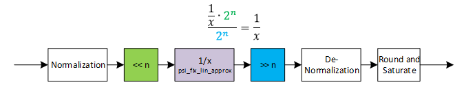

***

[**component list**](../README.md)

# psi_fix_inv
 - VHDL source: [psi_fix_inv](../../hdl/psi_fix_inv.vhd)
 - Testbench source: [psi_fix_inv_tb.vhd](../../testbench/psi_fix_inv_tb/psi_fix_inv_tb.vhd)

### Description

This entity implements a inversion (1/x) calculation.
The inversion function is approximated in the range 1 ... 2 using psi_fix_lin_approx_inv18b function and input/output are shifted to match the valid range of the approximation. The resulting implementation uses way less LUT than a CORDIC but multipliers and a bit or BRAM. Since the linear approximation of the inversion function is limited to 18 bits, the result can have a relative error (relative to the absolute value of the output):

### Generics
| Name           | type          | Description                                                   |
|:---------------|:--------------|:--------------------------------------------------------------|
| in_fmt_g       | psi_fix_fmt_t | must be unsigned, square root not defined for negative numbers |
| out_fmt_g      | psi_fix_fmt_t | output format fp                                              |
| round_g        | psi_fix_rnd_t | round or trunc                                                |
| sat_g          | psi_fix_sat_t | sat or wrap                                                   |
| ram_behavior_g | string        | rbw = read before write, wbr = write before read              |

### Interfaces
| Name   | In/Out   | Length     | Description                             |
|:-------|:---------|:-----------|:----------------------------------------|
| clk_i  | i        | 1          | system clock  |
| rst_i  | i        | 1          | system reset     |
| dat_i  | i        | in_fmt_g)  | data input                              |
| vld_i  | i        | 1          | valid signal input frequency sampling   |
| dat_o  | o        | out_fmt_g) | data output                             |
| vld_o  | o        | 1          | valid output frequency sampling         |

### Architecture

The figure below shows the architecture of the inversion calculation.

For simple implementation, all formats are normalized to the range +/- 2.0 and the normalized numbers are used for internal calculations. At the output, the normalization is reverted, so the normalization is completely invisible from outside.

Since the inversion approximation is only valid in the range between 1 and 2.0, all numbers are first shifted into this range and the shift is compensated at the output of the calculation. This setup also allows for relatively precise results, even though the inversion approximation is limited to 18 bits.
This concept works because:

---
[**component list**](../README.md)
