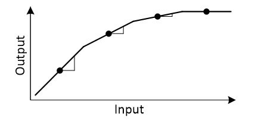
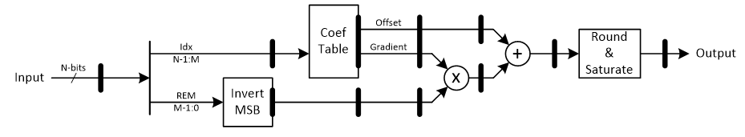
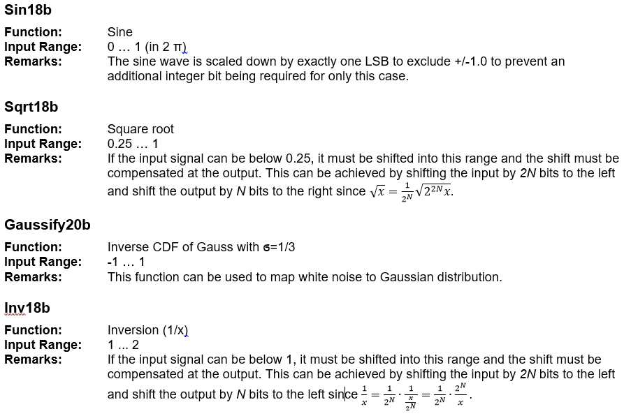

***
[**component list**](../README.md)

# psi_fix_lin_approx_calc
 - VHDL source: [psi_fix_lin_approx_calc](../hdl/psi_fix_lin_approx_calc.vhd)
 - Testbench source: [psi_fix_lin_approx_calc_tb.vhd](../testbench/psi_fix_lin_approx_calc_tb/psi_fix_lin_approx_calc_tb.vhd)

### Description

This is actually not just one component but a whole family of components. They are all function approximations based on a table containing the function values for regularly spaced points and linear approximation between them.

All components are based on the same implementation of the approximation (psi_fix_lin_approx_calc.vhd) and they only vary in number formats and coefficient tables.

The code is not written by hand but generated from Python (psi_fix_lin_approx.py). If a new function approximation shall be developed, it can first be designed using the function psi_fix_lin_approx.Design() that also helps finding the right settings. Afterwards VHDL code and a corresponding bittrueness testbench can be generated using psi_fix_lin_approx.GenerateEntity() and psi_fix_lin_approx.GenerateTb().

### Generics
| Name         | type          | Description                         |
|:-------------|:--------------|:------------------------------------|
| in_fmt_g     | psi_fix_fmt_t | depending ont table so do not touch |
| out_fmt_g    | psi_fix_fmt_t | depending ont table so do not touch |
| offs_fmt_g   | psi_fix_fmt_t | depending ont table so do not touch |
| grad_fmt_g   | psi_fix_fmt_t | depending ont table so do not touch |
| table_size_g | natural       | depending ont table so do not touch |
| rst_pol_g    | std_logic     | reset polarity                      |

### Interfaces
| Name         | In/Out   | Length        | Description                     |
|:-------------|:---------|:--------------|:--------------------------------|
| clk_i        | i        | 1             | system clock                    |
| rst_i        | i        | 1             | system reset                    |
| dat_i        | i        | in_fmt_g)     | data input                      |
| vld_i        | i        | 1             | valid input freqeuncy sampling  |
| dat_o        | o        | out_fmt_g)    | data output                     |
| vld_o        | o        | 1             | valid output frequency sampling |
| addr_table_o | o        | table_size_g) |                                 |
| data_table_i | i        | grad_fmt_g)   |                                 |

The implementation of the linear approximation is fully pipelined. This means it can take one input sample every clock cycle. As a result the handling of backpressure was not implemented.

### Architecture

The figure below shows the interpolation principle.

The complete range of the function is split into small sections. For each section the center point as well as the gradient are known and the output value is calculated from these two values (together with the difference between actual input and center point of the current segment).
The figure below shows the implementation of the approximation.

After splitting the input into index and reminder, the reminder is unsigned and related to the beginning of the segment. By inverting the MSB, the reminder is converted to the signed offset related to the center point of the segment.
The addition after the multiplication is executed at full precision and without rounding/truncation. This allows for the adder being implemented within a DSP slice. The rounding/truncation is then implemented in a separate pipeline stage.

### Functions details

---
[**component list**](../README.md)
