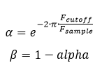
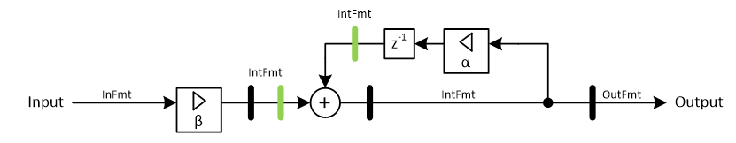

***

[**component list**](../README.md)

# psi_fix_lowpass_iir_order1
 - VHDL source: [psi_fix_lowpass_iir_order1](../hdl/psi_fix_lowpass_iir_order1.vhd)
 - Testbench source: [psi_fix_lowpass_iir_order1_tb.vhd](../testbench/psi_fix_lowpass_iir_order1_tb/psi_fix_lowpass_iir_order1_tb.vhd)

### Description

This entity implements a first order IIR low-pass with integrated coefficient calculation or input coefficient set as inputs.
Note that the filter is targeted mainly to applications where the cutoff frequency is only one or two orders of magnitude lower than the sampling frequency.
For cases where the cutoff frequency is close to DC, the requirements for coefficient precision grow with this straight-forward filter structure. In this case a completely different structure especially targeted to low cutoff frequencies should be used instead of this standard component.
The filter requires that the coefficient format is passed as generic. Therefore the coefficient calculations are given below, so the user can evaluate the coefficients and decide on a format with acceptable quantization error.

### Generics
| Name             | type          | Description                                                                     |
|:-----------------|:--------------|:--------------------------------------------------------------------------------|
| f_sample_hz_g    | real          | $$constant=100.0e6$$                                                            |
| f_cutoff_hz_g    | real          | $$constant=1.0e6$$                                                              |
| in_fmt_g         | psi_fix_fmt_t | $$constant='(1, 0, 15)'$$                                                       |
| out_fmt_g        | psi_fix_fmt_t | $$constant='(1, 0, 14)'$$                                                       |
| int_fmt_g        | psi_fix_fmt_t | number format for calculations, for details see documentation                   |
| coef_fmt_g       | psi_fix_fmt_t | coef format                                                                     |
| round_g          | psi_fix_rnd_t | round or trunc                                                                  |
| sat_g            | psi_fix_sat_t | sat or wrap                                                                     |
| pipeline_g       | boolean       | true = optimize for clock speed, false = optimize for latency $$ export=true $$ |
| reset_polarity_g | std_logic     | reset polarity active high = '1'                                                |

### Interfaces
| Name   | In/Out   | Length     | Description                            |
|:-------|:---------|:-----------|:---------------------------------------|
| clk_i  | i        | 1          | clock input  													|
| rst_i  | i        | 1          | sync. reset 													  |
| dat_i  | i        | in_fmt_g)  | data in                                |
| vld_i  | i        | 1          | input valid signal                     |
| dat_o  | o        | out_fmt_g) | data out                               |
| vld_o  | o        | 1          | output valid signal                    |

### Architecture

The figure below shows the implementation of the IIR filter. The pipeline stages in green are only present if pipeline_g = True.

---
[**component list**](../README.md)
