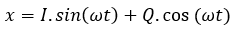
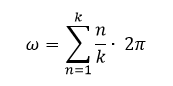
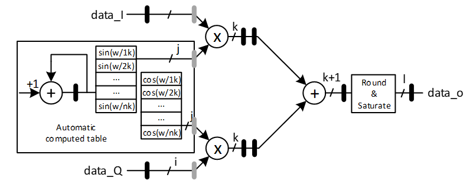

***

[**component list**](../README.md)

# psi_fix_mod_cplx2real
 - VHDL source: [psi_fix_mod_cplx2real](../../hdl/psi_fix_mod_cplx2real.vhd)
 - Testbench source: [psi_fix_mod_cplx2real_tb.vhd](../../testbench/psi_fix_mod_cplx2real_tb/psi_fix_mod_cplx2real_tb.vhd)

### Description

The block converts complex data to real output with weighted coefficient regarding the given clock ratio K as generic. Giving input data In-phase and Quadrature at the input gives the following result:

Where sin & cos angle are computed within a table as follow:

The total pipeline delay of the block is 5 or 6 clock cycles depending on generics.

### Generics
| Name              | type          | Description                                         |
|:------------------|:--------------|:----------------------------------------------------|
| generic(rst_pol_g | std_logic     | reset polarity                 |
| pl_stages_g       | integer       | select the pipelines stages required 6 optimal timing               |
| inp_fmt_g         | psi_fix_fmt_t | input format fp             |
| coef_fmt_g        | psi_fix_fmt_t | coef format                 |
| int_fmt_g         | psi_fix_fmt_t | internal format computation  |
| out_fmt_g         | psi_fix_fmt_t | output format fp         |
| ratio_g           | natural       | ratio for Frequency generation related to clock               |

### Interfaces
| Name      | In/Out   | Length       | Description                     |
|:----------|:---------|:-------------|:--------------------------------|
| clk_i     | i        | 1            | system clock      |
| rst_i     | i        | 1            | system reset       |
| dat_inp_i | i        | inp_fmt_g)-1 | in-phase data                   |
| dat_qua_i | i        | inp_fmt_g)-1 | quadrature data                 |
| vld_i     | i        | 1            | valid input frequency sampling  |
| dat_o     | o        | out_fmt_g)-1 | data output if/rf               |
| vld_o     | o        | 1            | valid output frequency sampling |

### Architecture

The figure below shows the architecture of the IQ modulator. The pipeline stages in grey are optional (depending on generics).

---
[**component list**](../README.md)
