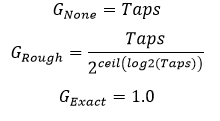
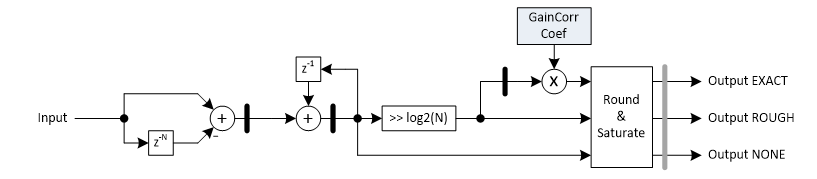

***

[**component list**](../README.md)

# psi_fix_mov_avg
 - VHDL source: [psi_fix_mov_avg](../hdl/psi_fix_mov_avg.vhd)
 - Testbench source: [psi_fix_mov_avg_tb.vhd](../testbench/psi_fix_mov_avg_tb/psi_fix_mov_avg_tb.vhd)

### Description
This entity implements a moving average implementation. It does not only calculate the moving sum but also compensate the gain from summing up multiple samples (either roughly by just shifting or exact by shifting and multiplication) if required.

The delay line is implemented using psi_common_delay, so the user can choose if SRLs or BRAMs shall be used or if the decision shall be taken automatically.

The gain of the filter including the compensation can be calculated by the formulas below:

### Generics
| Name        | type           | Description                                     |
|:------------|:---------------|:------------------------------------------------|
| in_fmt_g    | psi_fix_fmt_t; | input format $$ constant=(1,0,10) $$            |
| out_fmt_g   | psi_fix_fmt_t; | output format $$ constant=(1,1,12) $$           |
| taps_g      | positive;      | number of taps $$ constant=7 $$                 |
| gain_corr_g | string         | **“NONE”**	The gain is not compensated;	**“ROUGH”**	The gain is roughly compensated by shifting (0.5 < gain < 1.0);	**“EXACT”**	The gain is roughly compensated by shifting and then exactly adjusted using a	multiplier. The resulting gain is 1.0 (with the precision of the 17-bit coefficient).                           |
| round_g     | psi_fix_rnd_t  | round or trunc                                  |
| sat_g       | psi_fix_sat_t  | saturate or wrap                                |
| out_regs_g  | natural        | add number of output register $$ export=true $$ |

### Interfaces
| Name   | In/Out   | Length     | Description                             |
|:-------|:---------|:-----------|:----------------------------------------|
| clk_i  | i        | 1          | system clock 													 |
| rst_i  | i        | 1          | system reset  													 |
| dat_i  | i        | in_fmt_g)  | data input                              |
| vld_i  | i        | 1          | valid input sampling frequency          |
| dat_o  | o        | out_fmt_g) | data output                             |
| vld_o  | o        | 1          | valid output sampling frequency         |

### Architecture

The figure below shows the implementation of the moving average filter. All three gain correction implementations are shown in the figure while only the selected one is implemented of course.

The number formats are not shown in the figure for simplicity since there are some calculations required. For details about the number formats, refer to the code. All number formats are automatically chosen in a way that no overflows occur internally.
The output register is shown in grey since the number of output registers is configurable.

---
[**component list**](../README.md)
