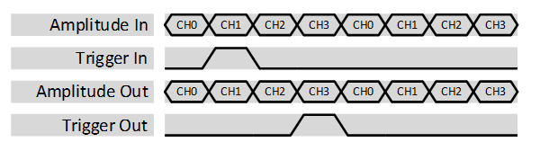
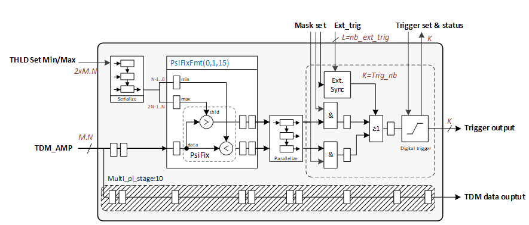

***

[**component list**](../README.md)

# psi_fix_nch_analog_trigger_tdm
 - VHDL source: [psi_fix_nch_analog_trigger_tdm](../hdl/psi_fix_nch_analog_trigger_tdm.vhd)
 - Testbench source: [psi_fix_nch_analog_trigger_tdm_tb.vhd](../testbench/psi_fix_nch_analog_trigger_tdm_tb/psi_fix_nch_analog_trigger_tdm_tb.vhd)

### Description

This entity embeds a system of triggering upon “analog” like data with settable thresholds (Min/Max level) that can be updated during run time. Data input must be fed in a TDM fashion whereas the parameters are set with parallel registers.
Prior to avoid multiple use of comparator, setting registers are converted from parallel to TDM and aligned with data to perform comparison. A set of mask allows to enable for each trigger which signal is observed.
A generic number of external trigger can be also set in addition to comparison value, as for the threshold a mas can be given per trigger to allow which external trigger input is observed for its particular trigger output.
The results are connected to digital triggers and the mechanism for arming and disarming is described in the psi_common library at the following link:  
https://github.com/paulscherrerinstitute/psi_common/blob/master/hdl/psi_common_trigger_digital.vhd

The trigger output is aligned with the TDM data stream to ensure that the last value contains the trigger, see next datagram:

The previous datagram shows the case where an external trigger is coming in, however it is important that the trigger out is aligned to the last channel of the TDM data stream.
These triggers can be used for the Multi Stream Data Acquisition available at the following link: https://github.com/paulscherrerinstitute/psi_multi_stream_daq

### Generics
| Name            | type          | Description                      |
|:----------------|:--------------|:---------------------------------|
| generic(ch_nb_g | natural       | number of input/output channel   |
| trig_ext_nb_g   | natural       | number of input external trigger |
| fix_fmt_g       | psi_fix_fmt_t | fp format                        |
| trig_nb_g       | natural       | number of output trigger         |

### Interfaces
| Name           | In/Out   | Length                    | Description                          |
|:---------------|:---------|:--------------------------|:-------------------------------------|
| clk_i          | i        | 1                         | processing clock                     |
| rst_i          | i        | 1                         | reset processing '1' <=> active high |
| dat_i          | i        | fix_fmt_g)-               | // data input                        |
| vld_i          | i        | 1                         | tdm strobe input                     |
| ext_i          | i        | trig_ext_nb_g-1           | external trigger input               |
| mask_min_i     | i        | trig_nb_g*ch_nb_g-1       | mask min results                     |
| mask_max_i     | i        | trig_nb_g*ch_nb_g-1       | mask max results                     |
| mask_ext_i     | i        | trig_nb_g*trig_ext_nb_g-1 | mask external trigger                |
| thld_min_i     | i        | fix_fmt_g)-1              | thld to set max window               |
| thld_max_i     | i        | fix_fmt_g)-1              | thld to set min window               |
| trig_clr_ext_i | i        | trig_nb_g*trig_ext_nb_g-1 | N.A                                  |
| trig_arm_i     | i        | trig_nb_g-1               | N.A                                  |
| dat_pipe_o     | o        | fix_fmt_g)-1              | data out pipelined for recording     |
| str_pipe_o     | o        | 1                         | strobe out pipelined for recording   |
| trig_o         | o        | trig_nb_g-1               | trigger out                          |
| is_arm_o       | o        | trig_nb_g-1               | trigger is armed                     |

### Architecture

---
[**component list**](../README.md)
