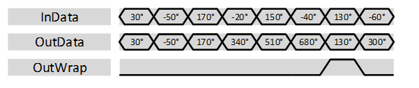

***

[**component list**](../README.md)

# psi_fix_phase_unwrap
 - VHDL source: [psi_fix_phase_unwrap](../../hdl/psi_fix_phase_unwrap.vhd)
 - Testbench source: [psi_fix_phase_unwrap_tb.vhd](../../testbench/psi_fix_phase_unwrap_tb/psi_fix_phase_unwrap_tb.vhd)

### Description

This entity implements phase unwrapping by bringing all input angles into the range of +/- 1π (+/- 180°) of the previous sample and summing up the inputs.
Since phase unwrapping can accumulate infinitely, there is no theoretically sufficient output format. Therefore the user can choose the output format. If the unwrapping exceeds this format, the error is detected and signaled at the output. In this case the unwrapping is reset. This is shown by the figure below. In the figure, the output range is 4π (720°).

It is clearly visible, that when exceeding the maximum range, the output is reset to the input angle and unwrapping continues from there. So the phase itself is still correct (phase modulo 360° is correct) but there is a discontinuity in the output.

### Generics
| Name      | type          | Description    |
|:----------|:--------------|:---------------|
| in_fmt_g  | psi_fix_fmt_t | input format, usually (1,0,x) or (0,1,x)  |
| out_fmt_g | psi_fix_fmt_t | output format signed and at least one integer bit |
| round_g   | psi_fix_rnd_t | round or trunc (use trunc for high clock speed) |
| rst_pol_g | std_logic     | reset polarity |

### Interfaces
| Name   | In/Out   | Length     | Description                |
|:-------|:---------|:-----------|:---------------------------|
| clk_i  | i        | 1          | system clock |
| rst_i  | i        | 1          | system reset    |
| dat_i  | i        | in_fmt_g)  | data input  in π               |
| vld_i  | i        | 1          | valid signal input         |
| dat_o  | o        | out_fmt_g) | data output  in π              |
| vld_o  | o        | 1          | valid signal output        |
| wrap_o | o        | 1          | Indicates that the range was exceeded and that the output does therefore contain a discontinuity.              |

---
[**component list**](../README.md)
