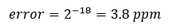
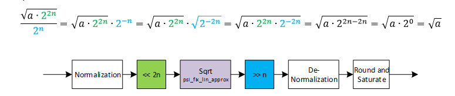

***

[**component list**](../README.md)

# psi_fix_sqrt
 - VHDL source: [psi_fix_sqrt](../../hdl/psi_fix_sqrt.vhd)
 - Testbench source: [psi_fix_sqrt_tb.vhd](../../testbench/psi_fix_sqrt_tb/psi_fix_sqrt_tb.vhd)

### Description

This entity implements a square root calculation.
The square root function is approximated in the range 0.25-1.0 using [psi_fix_lin_approx_sqrt](../../hdl/psi_fix_lin_approx_sqrt.vhd) function and input/output are shifted to match the valid range of the approximation. The resulting implementation uses way less LUT than a CORDIC but multipliers and a bit or BRAM. Since the linear approximation of the square root function is limited to 18 bits, the result can have a relative error (relative to the absolute value of the output):

### Generics
| Name           | type          | Description                                                   |
|:---------------|:--------------|:--------------------------------------------------------------|
| in_fmt_g       | psi_fix_fmt_t | must be unsigned, wuare root not defined for negative numbers |
| out_fmt_g      | psi_fix_fmt_t | output format fp                                              |
| round_g        | psi_fix_rnd_t | round or trunc                                                |
| sat_g          | psi_fix_sat_t | sat or wrap                                                   |
| ram_behavior_g | string        | rbw = read before write, wbr = write before read              |
| rst_pol_g      | std_logic     | N.A                                                           |

### Interfaces
| Name   | In/Out   | Length     | Description                 |
|:-------|:---------|:-----------|:----------------------------|
| clk_i  | i        | 1          | $$ type=clk; freq=127e6 $$  |
| rst_i  | i        | 1          | $$ type=rst; clk=clk $      |
| dat_i  | i        | in_fmt_g)  | data input                  |
| vld_i  | i        | strobe     | valid signal (strobe input) |
| dat_o  | o        | out_fmt_g) | data output                 |
| vld_o  | o        | 1          | output signal               |

### Architecture

The figure below shows the architecture of the square root calculation.

For simple implementation, all formats are normalized to the range +/-1.0 and the normalized numbers are used for internal calculations. At the output, the normalization is reverted, so the normalization is completely invisible from outside.

Since the square root approximation is only valid in the range between 0.25 and 1.0, all numbers are first shifted into this range and the shift is compensated at the output of the calculation. This setup also allows for relatively precise results, even though the square-root approximation is limited to 18 bits.
This concept works because:

---
[**component list**](../README.md)
