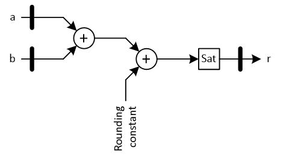
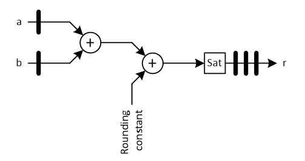
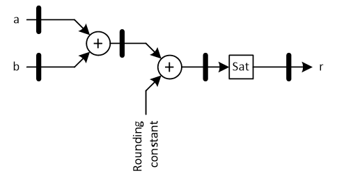
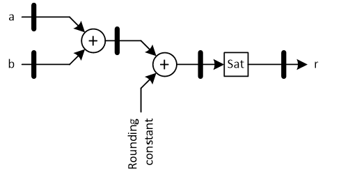
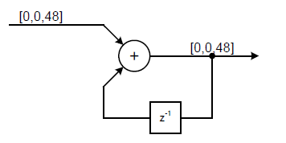
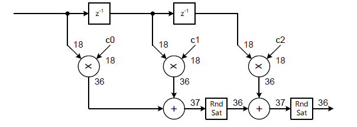
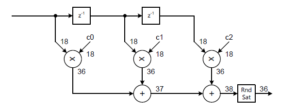
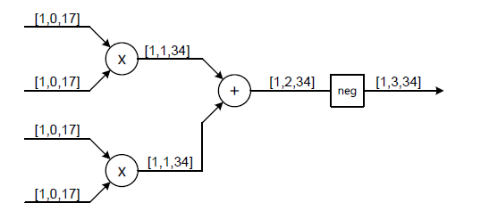
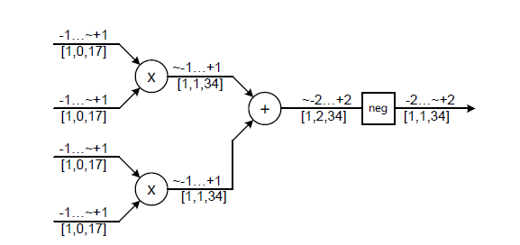

***

[**component list**](../README.md)

### Tips & tricks
---
####	Library Setup
The psi_fix library refers to psi_common  and psi_tb relatively and assumes the contents of these repositories are compiled into the same VHDL library.
There are two common ways of setting up projects without troubles:
1.	psi_fix, psi common and psi_tb are compiled into a VHDL library called psi_lib. The project specific code is compiled to a different library and it refers to library elements using psi_lib.<any_entity>.
2.	All code of the complete project including psi_fix, psi common and psi_tb is compiled into the same library. Independently of the name of that library, library elements can be referred to using work.<any_entity>.
---
#### Heavy Pipelining
#####	Problem Description
The following code may lead to suboptimal results for very high clock frequencies because there are three operations in the same pipeline stage:
- The actual addition
-	Rounding (adding of a rounding constant)
-	Limiting

```vhdl
constant aFmt_c : PsiFixFmt_t := (1, 8, 8);
constant bFmt_c : PsiFixFmt_t := (1, 8, 8);
constant rFmt_c : PsiFixFmt_t := (1, 8, 0);

…

p : process(Clk)
begin
   if rising_edge(Clk) then
      r <= PsiFixAdd(a, aFmt_c, b, bFmt_c, rFmt_c, PsiFixRound, PsiFixSat);
   end if;
end process;
```

This leads to the implementation shown below.




**Heavy Pipelining, Problem Description**

####	Solution 1: Register Retiming
Today’s FPGA tools are quite good at register retiming. This means that the tools moves pipeline stages to optimize timing. ISE is also able to do retiming but it must be actively enabled in the project settings (synthesis).

Thanks to retiming, the user can just add a few pipeline stages at the output of the logic and the tool will move them into the logic to optimize timing.

```vhdl
constant aFmt_c : PsiFixFmt_t := (1, 8, 8);
constant bFmt_c : PsiFixFmt_t := (1, 8, 8);
constant rFmt_c : PsiFixFmt_t := (1, 8, 0);
…
p : process(Clk)
begin
   if rising_edge(Clk) then
      r1 <= PsiFixAdd(a, aFmt_c, b, bFmt_c, rFmt_c, PsiFixRound, PsiFixSat);
      r2 <= r1;
      r <= r2;
   end if;
end process;
```

The code above theoretically describes the following circuit which is not more timing-optimal than the original circuit:



**Heavy Pipelining, Retiming, and Implementation without retiming**

However, if register retiming is applied, the tool will convert the circuit into something as shown below. This is way more timing optimal and allows achieving higher clock frequencies.



**Heavy Pipelining, Retiming, Implementation with retiming**

The advantage of the solution using retiming is, that the pipeline registers can be moved at a very fine-grained level (even finer than one VHDL code line) and the tool is free to move them to the optimal place.
The drawback is that this approach relies on the tool to recognize the timing problem and fix it by applying retiming. If the tool fails to do this for whatever reason, the design will not meet timing.

####	Solution 2: Manual Splitting
The operation can be split into multiple stages manually on VHDL level. This can be done by not doing all steps in one VHDL line but one after the other in multiple lines. Of course intermediate number formats must be chosen accordingly to ensure correct operation. An example is given below.

```vhdl
constant aFmt_c   : PsiFixFmt_t := (1, 8, 8);
constant bFmt_c   : PsiFixFmt_t := (1, 8, 8);
constant addFmt_c : PsiFixFmt_t := (1, 9, 8); -- + 1 Int-Bit for addition
constant rndFmt_c : PsiFixfmt_t := (1, 10, 8); -- + 1 Int-Bit for adding RC
constant rFmt_c   : PsiFixFmt_t := (1, 8, 0);

p : process(Clk)
begin
   if rising_edge(Clk) then
      -- addition only, no rounding or satturation
      add <= PsiFixAdd(a, aFmt_c, b, b_Fmt_c, addFmt_c, PsiFixTrunc, PsiFixWrap);
      -- rounding only
      rnd <= PsiFixResize(add, addFmt_c, rndFmt_c, PsiFixRound, PsiFixWrap);
      -- saturation ony
      r <= PsiFixResize(rnd, rndFmt_c, rFmt_c, PsiFixTrunc, PsiFixSat);
   end if;
end process;
```

This code directly leads to the implementation shown below and does not rely on the tools to do the retiming.


**Heavy Pipelining, Manual Splitting**

The advantage of this approach is that it does not rely on any tool-optimization.
The disadvantage is that slightly more code is required. Of course the tools can still apply retiming to move the registers if required.

---

### Precision of intermediate results

Keep in mind that the limited precision of double precision numbers used in Python applies to each and every intermediate result. This is explained based on an example:



**Example for a problematic Python model regarding intermediate results**

Input and output are both in the number range that can be perfectly represented by double precision floating point numbers. The most obvious and performant (beause vector-based) implementation of this circuit in Python is:
```python
out = mod(cumsum(input), 1.0);
```

For small numbers and reasonable sizes of the input vector this works perfectly. However, if the input is close to 1, already with input vectors of more than 16 elements, the result of cumsum becomes larger than the 52-bits supported by double precision number. Of course the mod operation brings the result back into a 48-bit range but summation errors caused by cumsum cannot be fixed by this, so the result is wrong. The larger the input and the bigger the input vector, the more wrong the result becomes.

There is no general solution for this problem but the example could be fixed by using int64 instead of normal double precision numbers in Python. For more complex calculations loops may be required since the fi library from Python does not support all operations (cumsum for example is not supported).

---

### Built-in Python Functions
Built-in Python functions offer best performance, so they should be used if possible. The issue with these built-in Pthon functions is that they always do calculations at full precision. So to use them in bit-true models, the circuit must be designed to do all calculations in full precision.
Of course the circuit design should not be significantly influenced by Python models but in many cases very slight changes allow using built-in functions at very little or even no cost in terms of resources. This is demonstrated on an example below.



**FIR design that does not allow using Pythons filter() function**

The design shown in the figure above does not allow using Pythons filter function since it does rounding and saturation inside the filter (after every MAC stage, the number of bits is reduced to 36). For long filters this may slightly reduce the number of bits required in the adder chain but it does lead to significant simulation speed penalties.



**FIR design that allows using Pythons filter() function**

The design shown in the figure above allows using Pythons filter function since it executes all calculations inside the filter in full precision and only applies rounding/saturation to the result. This matches a Python implementation that first calls filter and then rounds/saturates the result. It requires higher word-width in the adder-chain but has way faster simulation speed.
Side note: The second implementation finally is even more resource efficient since a few more bits in the adders are less resource consuming than the additional rounding/saturation stages.
Using built-in Python functions may not always be possible: For example IIR filters can theoretically also be simulated using the filter function but this does not allow to simulate any quantization effects inside IIR filters that are required in IIR filters by nature. So always check if your fast Python implementation is really bit-true to what you are going to implement in VHDL.

---

### Calculating Frequency Responses
Sometimes it is required to estimate the frequency response of a not completely linear system or of a system with an infinite impulse response. An alternative of calculating the frequency response in a mathematical way is to inject a dirac impulse, acquire the impulse response of the system (or a sufficiently large part of it) and call **freqz** on the impulse response. This approach is not perfectly exact but in many cases sufficient and very easy to do.

---

### Fixed-poiunt design

#### Get ranges correct

One of the worst thing that can happen in a DSP design is an overflow in a calculation that is not saturated because an overflow was regarded as impossible at this point. If you question this point, just do a google search for “Ariane-5 Overflow” and click on the first video you find…
While the general fixed-point design rules are well known, you can find a list of less obvious points below:
- Rounding can lead to overflows (the maximum representable number in [0,0,17] translates to 1.0
when rounding to [0,0,16] is applied)
- Negation of signed numbers can lead to overflow (the range [1,0,x] includes -1.0 but it does not
include +1.0)
- Multiplying two signed numbers leads to one additional integer bit (-1.0 x -1.0 results in +1.0, so
[1,a,b] x [1,c,d] results in [1,a+b+1,c+d])

Of course some bits can also be saved at non obvious points. To achieve this, keep always in mind the
maximum theoretically possible value instead of working with formats only. This is explained on an example below:

- Let’s have a look at the implementation of the formula −(𝑎 ∙ 𝑏 + 𝑐 ∙ 𝑑) with all inputs being in the format [1,0,17].
-
Blindly applying the rules described above would lead to the following formats:



**Number formats with blind application of bit-growth rules**



**Number formats based on theoretical maximum numbers**

In the example 2 bits can be saved. In areal-world design, such savings can easily decide if a single DSP slice is sufficient or not. Alternatively the bits not required can be spent on more precision for improved signal quality.

**IMPORTANT**: It is strongly suggested to use theoretical maximum numbers (i.e. base the calculations only on the input number formats). Making assumptions such as “the input signal never exceeds 0.7 because the preceding block ensures this” could easily lead to a design to fail if the preceding block is changed. As a result this approach is only allowed inside one single processing block.

#### Minimize Rounding/Truncation/Saturation

Fixed-point design is pretty straight forward as long as word widths just grow along with the bit growth-rules. As soon as rounding/truncation/saturation come into play there are more things to test and the system becomes less linear.

As a result, quantization/saturation should be applied only very selectively at points where there is a requirement for it. Examples are reduction of the word-width to 25-bits to fit a DSP-slice or at the output of a calculation block.

Usually having a wide data path requires less resources than adding more rounding/truncation/saturation to minimize the word-width, so keeping these operations at a minimum is also wise in terms or resource usage.

---
[**component list**](../README.md)
