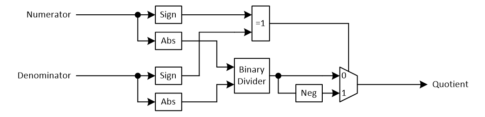

***

[**component list**](index.md)

# psi_fix_bin_div
 - VHDL source: [psi_fix_bin_div](../hdl/psi_fix_bin_div.vhd)
 - Testbench source: [psi_fix_bin_div_tb.vhd](../testbench/psi_fix_bin_div_tb/psi_fix_bin_div_tb.vhd)

### Description
This component implements a fixed point binary divider.

Quotient=Numerator/Denominator

### Architecture

The component converts numerator and denominator to unsigned numbers, so a standard binary divider can be implemented. At the output, the sign is restored correctly.

### Generics
| Name        | type          | Description        |
|:------------|:--------------|:-------------------|
| num_fmt_g   | psi_fix_fmt_t | numerator format   |
| denom_fmt_g | psi_fix_fmt_t | denominator format |
| out_fmt_g   | psi_fix_fmt_t | ouput format       |
| round_g     | psi_fix_rnd_t | rounding or trunc  |
| sat_g       | psi_fix_sat_t | saturation or wrap |
| rst_pol_g   | std_logic     | polarity reset     |
| rst_sync_g  | boolean       | sync reset ?       |

### Interfaces
| Name          | In/Out   | Length      | Description                    |
|:--------------|:---------|:------------|:-------------------------------|
| clk_i         | i        | 1           | clk system                     |
| rst_i         | i        | 1           | rst system depends on polarity |
| vld_i         | i        | 1           | valid signal input             |
| rdy_i         | o        | 1           | ready signal output            |
| numerator_i   | i        | numfmt_g    | numerator to divide            |
| denominator_i | i        | denomfmt_g  | denominator divider            |
| vld_o         | o        | 1           | valid output signal            |
| result_o      | o        | outfmt_g    | result output = num/den        |

---
[**component list**](index.md)
