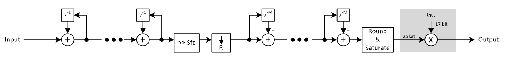
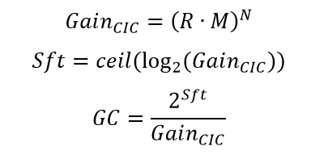
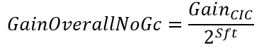

***

[**component list**](index.md)

# psi_fix_cic_dec_cfg_1ch
 - VHDL source: [psi_fix_cic_dec_cfg_1ch](../hdl/psi_fix_cic_dec_cfg_1ch.vhd)
 - Testbench source: [psi_fix_cic_dec_cfg_1ch_tb.vhd](../testbench/psi_fix_cic_dec_cfg_1ch_tb/psi_fix_cic_dec_cfg_1ch_tb.vhd)

### Description

This component implements a simple CIC decimator for a single channel. The decimation ratio must be known at compile time.
The CIC component always corrects the CIC gain roughly by shifting. As a result, the gain of the component is always between 0.5 and 1.0. Additionally a multiplier for exact gain adjustment can be added by setting the generic AutoGainCorr_g to true. In this case the gain is corrected to exactly 1.0.
The CIC is able to process one input sample per clock cycle. Therefore no backpressure handling is implemented on the input.
CIC are most commonly used in streaming signal processing systems that require processing or storing the data at the full speed anyway. So no backpressure handling is implemented on the output side for simplicity

### Architecture

The figure below shows the architecture of the CIC decimation filter.
Since the integrators are responsible for most of the CIC gain, the numbers are shifted and truncated after the integrator sections to the width required for producing less than 1 LSB error at the output. This allows saving some resources in the differentiator sections.
Note that the number format for the differentiator sections has one additional fractional bit (compared to the output format) per section. This results from the fact that depending on the signal frequency, the differentiators can have a gain up to two. This way the least significant bit at the input of the differentiators that can change the output by one LSB is preserved.
If the gain correction multiplier is used, signal path is chosen to be 25 bits wide and the gain correction coefficient is 17 bits (unsigned). For most implementations this design decisions are sufficient. If other requirements exist (e.g. very wide signal path), a project specific implementation of the CIC is required.

The symbols are defined as follows:
- R	Decimation ratio
- M	Differential delay
- N	CIC order
- Sft	Number of bits to shift (to compensate overall gain to 0.5 < gain < 1.0)
- GC	Gain correction factor to compensate overall gain to 1.0
Some of the most common formulas are given below.

For the case that the gain correction amplifier is disabled, the overall gain of the CIC is:

### Generics
| Name             | type          | Description                                                             |
|:-----------------|:--------------|:------------------------------------------------------------------------|
| order_g          | integer       | filter order                                                            |
| max_ratio_g      | natural       | Maximum supported decimation ratio. Replaces the Ratio_g generic of the original filter                                            |
| diff_delay_g     | natural       | differential delay                                                      |
| in_fmt_g         | psi_fix_fmt_t | input format fp                                                         |
| out_fmt_g        | psi_fix_fmt_t | output format fp                                                        |
| rst_pol_g        | std_logic     | reset polarity active = '1'                                             |
| auto_gain_corr_g | boolean       | True = Multiplier for exact gain compensation is implemented;	False = compensation by shift only |

### Interfaces
| Name            | In/Out   | Length    | Description                                                                               |
|:----------------|:---------|:----------|:------------------------------------------------------------------------------------------|
| clk_i           | i        | 1         | clk system                                                                                |
| rst_i           | i        | 1         | rst system                                                                                |
| cfg_ratio_i     | i        | 1         | Decimation ratio – 10 = no decimation, 1 = decimation by 2, etc.                          |
| cfg_shift_i     | i        | 7         | shifting by more than 255 bits is not supported, this would lead to timing issues anyways Number of bits to shift for gain compensation.  |
| cfg_gain_corr_i | i        | 16        | gain correction factor in format [0,1,16]                                                 |
| dat_i           | i        | infmt_g)  | data input                                                                                |
| vld_i           | i        | 1         | valid input                                                                               |
| dat_o           | o        | outfmt_g) | data output                                                                               |
| vld_o           | o        | 1         | valid otuput                                                                              |
| busy_o          | o        | 1         | busy signal output active high                                                            |

[**component list**](index.md)
