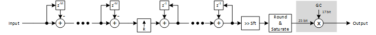
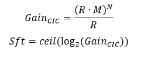
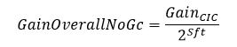

***

[**component list**](index.md)

# psi_fix_cic_int_fix_1ch
 - VHDL source: [psi_fix_cic_int_fix_1ch](../hdl/psi_fix_cic_int_fix_1ch.vhd)
 - Testbench source: [psi_fix_cic_int_fix_1ch_tb.vhd](../testbench/psi_fix_cic_int_fix_1ch_tb/psi_fix_cic_int_fix_1ch_tb.vhd)

### Description

This component implements a simple CIC interpolator for a single channel. The interpolation ratio must be known at compile time.
The CIC component always corrects the CIC gain roughly by shifting. As a result, the gain of the component is always between 0.5 and 1.0. Additionally a multiplier for exact gain adjustment can be added by setting the generic auto_gain_corr_g to true. In this case the gain is corrected to exactly 1.0.

The CIC interpolator requires full handshaking including the handling of back-pressure at the input since it can only take one sample every N clock cycles. As a result, the InRdy signal is required to signal when an input sample was processed.
Full handshaking at the output side was implemented mainly to allow equally spaced output samples (in time). By nature the filter calculates multiple output samples back-to-back after an input sample arrived. For output rates lower than the clock-speed, this leads to a bursting behavior which is often (but not always) undesirable. By controlling the OutRdy signal, the user can control the output sample-rate and –spacing exactly.

### Generics
| Name             | type          | Description                                                        |
|:-----------------|:--------------|:-------------------------------------------------------------------|
| order_g          | integer       | cic filter order                                                   |
| ratio_g          | integer       | ratio interpolation                                                |
| diff_delay_g     | natural       | differential delay                                                 |
| in_fmt_g         | psi_fix_fmt_t | input format                                                       |
| out_fmt_g        | psi_fix_fmt_t | output fromat                                                      |
| rst_pol_g        | std_logic     | reset polarity active high                                         |
| auto_gain_corr_g | boolean       | uses up to 25 bits of the datapath and 17 bit correction parameter |

### Interfaces
| Name   | In/Out   | Length     | Description                      |
|:-------|:---------|:-----------|:---------------------------------|
| clk_i  | i        | 1          | clk system                       |
| rst_i  | i        | 1          | rst system                       |
| dat_i  | i        | in_fmt_g)  | data input                       |
| vld_i  | i        | 1          | valid input frequency sampling   |
| rdy_o  | o        | 1          | ready signal output              |
| dat_o  | o        | out_fmt_g) | data output                      |
| vld_o  | o        | 1          | valid signal output new fs*ratio |
| rdy_i  | i        | 1          | ready signal input               |

### Architecture

The figure below shows the architecture of the CIC interpolation filter.
Note that the number format for the differentiator sections has one additional integer bit (compared to the input format) per section. This results from the fact that depending on the signal frequency, the differentiators can have a gain up to two.
If the gain correction multiplier is used, signal path is chosen to be 25 bits wide and the gain correction coefficient is 17 bits (unsigned). For most implementations this design decisions are sufficient. If other requirements exist (e.g. very wide signal path), a project specific implementation of the CIC is required.

The symbols are defined as follows:
- R	Interpolation ratio
- M	Differential delay
- N	CIC order
- Sft	Number of bits to shift (to compensate overall gain to 0.5 < gain < 1.0)
- GC	Gain correction factor to compensate overall gain to 1.0
Some of the most common formulas are given below.

For the case that the gain correction amplifier is disabled, the overall gain of the CIC is:

Since this formula evaluates to 1.0 for the case R=x^2 (interpolation ratio is a power of two), the gain correction multiplier is not required in this case.
The optimal setting for the differential delay depends on the use case. Only the values 1 and 2 are supported. Other values are uncommon in real-life. Usually 1 is used if the input signal is already oversampled (does not contain frequency components close to fs/2) and 2 is used otherwise.
Note that the CIC does not control timing on its own. This means by default, the CIC outputs one sample per clock cycle. If the input sample rate is slow, the output is bursting. If the time between two output samples has to be constant, the timing can be controlled by applying pulses at the desired frequency to the OutRdy handshaking signal. The reason for the CIC to not control any timing at the output is that this is a library component and it may also be used in offline processing algorithms.

---
[**component list**](index.md)
