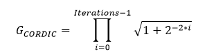
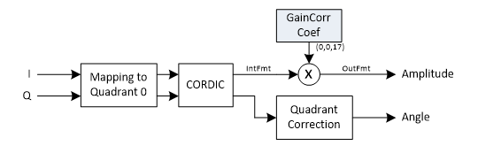

***

[**component list**](index.md)

# psi_fix_cordic_vect
 - VHDL source: [psi_fix_cordic_vect](../hdl/psi_fix_cordic_vect.vhd)
 - Testbench source: [psi_fix_cordic_vect_tb.vhd](../testbench/psi_fix_cordic_vect_tb/psi_fix_cordic_vect_tb.vhd)

### Description
This entity implements the CORDIC algorithm for Cartesian to Polar conversion.
The CORDIC gain can optionally be compensated. If the gain is compensated externally, it is important to know the exact gain. Therefore the formula for calculating the CORDIC gain is given:

For the internal gain compensation it is recommended to choose an internal_fmt_g in a way that it can be processed with one multiplier (e.g. for 7-series max. 25 bits).

### Generics
| Name              | type          | Description                                                                         |
|:------------------|:--------------|:------------------------------------------------------------------------------------|
| in_fmt_g          | psi_fix_fmt_t | must be signed                                               |
| out_fmt_g         | psi_fix_fmt_t | must be unsigned                                            |
| internal_fmt_g    | psi_fix_fmt_t | must be signed The more fractional bits, the more precise the calculation gets.	Choose enough integer bits to ensure that no overflows happen. For inputs in the form (1,0,x) that are always within the unit circle, (1,1,y) can be used.	For inputs in the form (1,0,x) that can contain arbitrary values for X and Y, (1,2,y) can be used.
                                         |
| angle_fmt_g       | psi_fix_fmt_t | must be unsigned                                             |
| angle_int_fmt_g   | psi_fix_fmt_t | must be signed                                               |
| iterations_g      | natural       | number of iteration prior to get results                          |
| gain_comp_g       | boolean       | **True**		The CORDIC gain (~1.62) is compensated internally with a multiplier. **False**		The CORDIC gain is not compensated.
                 |
| round_g           | psi_fix_rnd_t | round or trunc (use truncation for high clock speeds)                                                   |
| sat_g             | psi_fix_sat_t | saturation or wrap (use wrapping for high clock speeds)                                              |
| mode_g            | string        | **“PIPELINED”**	One pipeline stage per CORDIC iteration, can take one sample every clock cycle. 	**“SERIAL”**		One clock cycle per iteration, less logic utilization   |
| pl_stg_per_iter_g | integer       |Number of pipeline stages per iteration (1 or 2).This setting only has an effect on the pipelined implementation. For the serial 	implementation it does not have any effect.
 |

### Interfaces
| Name      | In/Out   | Length       | Description                              |
|:----------|:---------|:-------------|:-----------------------------------------|
| clk_i     | i        | 1            | clk system $$ type=clk; freq=100e6 $$    |
| rst_i     | i        | 1            | rst system $$ type=rst; clk=clk $$       |
| dat_inp_i | i        | in_fmt_g)    | data input input                         |
| dat_qua_i | i        | in_fmt_g)    | dat quadrature input                     |
| vld_i     | i        | 1            | valid signal in                          |
| rdy_i     | o        | 1            | ready signal output $$ lowactive=true $$ |
| dat_abs_o | o        | out_fmt_g)   | data amplitude output                    |
| dat_ang_o | o        | angle_fmt_g) | dat angle output  Angle of the output signal (in 2π => 0.5 = π = 180°)                       |
| vld_o     | o        | 1            | valid output                             |

### Architecture

The figure below shows the implementation of the vectoring CORDIC. The algorithm only works correctly in quadrant zero (where I and Q are positive). Therefore the input is mapped into this quadrant by sign swapping and the effect of this mapping is compensated at the output.

---
[**component list**](index.md)
