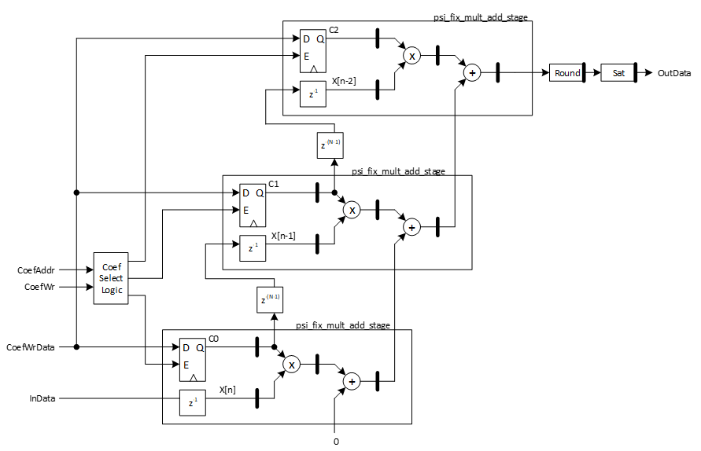

***

[**component list**](index.md)

# psi_fix_fir_par_nch_chtdm_conf
 - VHDL source: [psi_fix_fir_par_nch_chtdm_conf](../hdl/psi_fix_fir_par_nch_chtdm_conf.vhd)
 - Testbench source: [psi_fix_fir_par_nch_chtdm_conf_tb.vhd](../testbench/psi_fix_fir_par_nch_chtdm_conf_tb/psi_fix_fir_par_nch_chtdm_conf_tb.vhd)

### Description

This entity implements a fully parallel FIR filter (without decimation). It can process one channel or more channels in TDM but for all channels the same coefficients are used. Coefficients can either be configured at runtime or statically via generics.

### Generics
| Name            | type          | Description                                  |
|:----------------|:--------------|:---------------------------------------------|
| in_fmt_g        | psi_fix_fmt_t | input format fp $$ constant=(1,0,15) $$      |
| out_fmt_g       | psi_fix_fmt_t | output format fp $$ constant=(1,2,13) $$     |
| coef_fmt_g      | psi_fix_fmt_t | coeffcient format fp $$ constant=(1,0,17) $$ |
| channels_g      | natural       | number of channel $$ export=true $$          |
| taps_g          | natural       | taps number $$ export=true $$                |
| rnd_g           | psi_fix_rnd_t | round or trunc                               |
| sat_g           | psi_fix_sat_t | sat or wrap                                  |
| use_fix_coefs_g | boolean       | use fixed coef or updated from table         |
| coefs_g         | t_areal       | initial value for coef                       |

### Interfaces
| Name   | In/Out   | Length     | Description                             |
|:-------|:---------|:-----------|:----------------------------------------|
| clk_i  | i        | 1          | system clock $$ type=clk; freq=100e6 $$ |
| rst_i  | i        | 1          | system reset $$ type=rst; clk=clk $$    |
| dat_i  | i        | in_fmt_g)  | data input fp                           |
| vld_i  | i        | 1          | valid input frequency sampling          |
| dat_o  | o        | out_fmt_g) | data output                             |
| vld_o  | o        | 1          | valid output frequency sampling         |

### Architecture

The FIR filter is based on a chain of psi_fix_mult_add_stage stages. For the single channel implementation they are connected directly, for the multi-channel implementation, appropriate delays are placed in between them.
The filter is optimized for most efficient implementation at high clock speed since fully parallel filters are only used at the very input of a signal processing chain where clock-speed is highest.
The figure below shows an example with three taps.

---
[**component list**](index.md)
