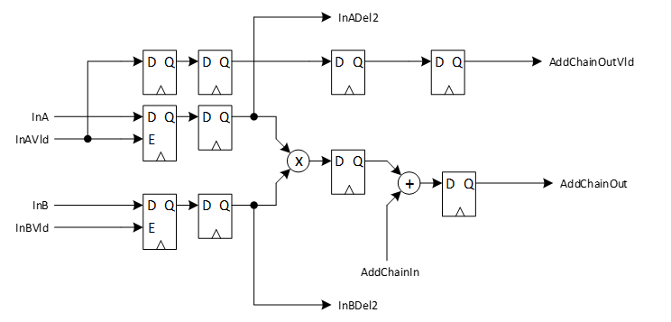
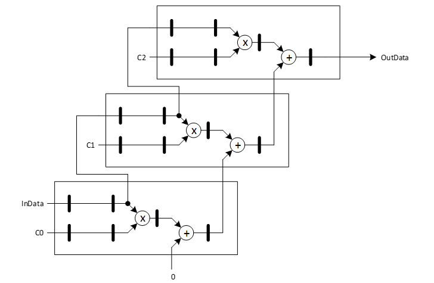

***

[**component list**](index.md)

# psi_fix_mult_add_stage
 - VHDL source: [psi_fix_mult_add_stage](../hdl/psi_fix_mult_add_stage.vhd)
 - Testbench source: [psi_fix_mult_add_stage_tb.vhd](../testbench/psi_fix_mult_add_stage_tb/psi_fix_mult_add_stage_tb.vhd)

### Description
This entity implements a multiply-add stage that can be implemented efficiently for FPGAs supporting multiply-adder chains (as Xilinx 6- and 7-Series do for example). It is written in pure VHDL and also synthesizable for other FPGA families but it may lead to less optimal results.
This multiply-add stage is used for implementing parallel or semi-parallel filters efficiently.

### Generics
| Name           | type          | Description                                                                        |
|:---------------|:--------------|:-----------------------------------------------------------------------------------|
| in_a_fmt_g     | psi_fix_fmt_t | data a input format fp                                                             |
| in_b_fmt_g     | psi_fix_fmt_t | data b input format fp                                                             |
| add_fmt_g      | psi_fix_fmt_t | output format fp                                                                   |
| in_b_is_coef_g | boolean       | if true, inbvld is only used to write a cst coef to the input reg of the dsp slice |
| rst_pol_g      | std_logic     | reset polarity                                                                     |

### Interfaces
| Name            | In/Out   | Length      | Description                                                                     |
|:----------------|:---------|:------------|:--------------------------------------------------------------------------------|
| clk_i           | i        | 1           | system clock $$ type=clk; freq=100e6 $$                                         |
| rst_i           | i        | 1           | system reset $$ type=rst; clk=clk_i $$                                          |
| dat_a_i         | i        | in_a_fmt_g) | data in put a                                                                   |
| vld_a_i         | i        | 1           | vld a                                                                           |
| del2_a_o        | o        | efficient   | registred data a by 2 clock cycles (efficient pipeline for fir implementation)  |
| dat_b_i         | i        | in_b_fmt_g) | data input b                                                                    |
| vld_b_i         | i        | 1           | vld b                                                                           |
| del2_b_o        | o        | efficient   | registered data b by 2 clock cycles (efficient pipeline for fir implementation) |
| chain_add_i     | i        | add_fmt_g)  | adder chain input data                                                          |
| chain_add_o     | o        | add_fmt_g)  | adder chain output data                                                         |
| chain_add_vld_o | o        | 1           | adder chain output valid                                                        |

### Architecture
The figure below shows the architecture of the psi_fix_mult_add_stage.

The example below shows how to use the multiply-add stage for an efficient fully-parallel single channel FIR implementation with three taps.

---
[**component list**](index.md)
